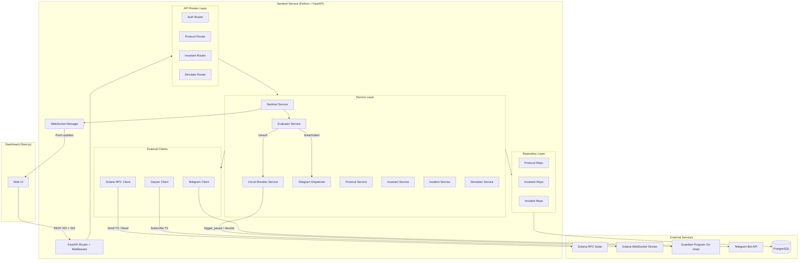
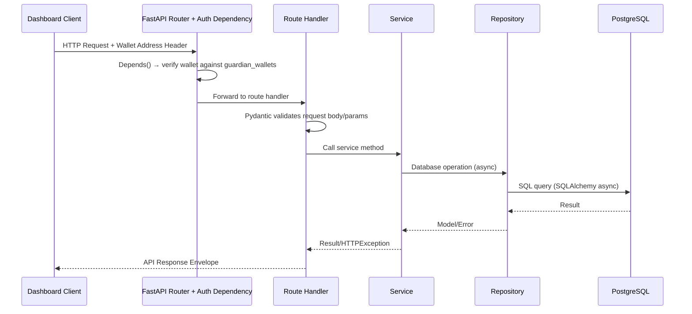
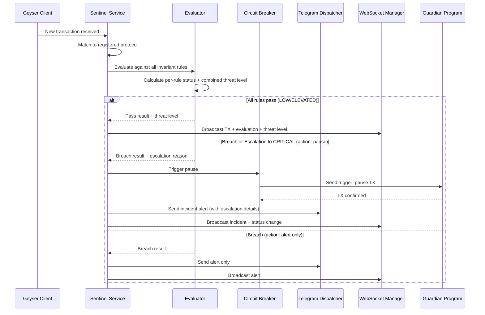
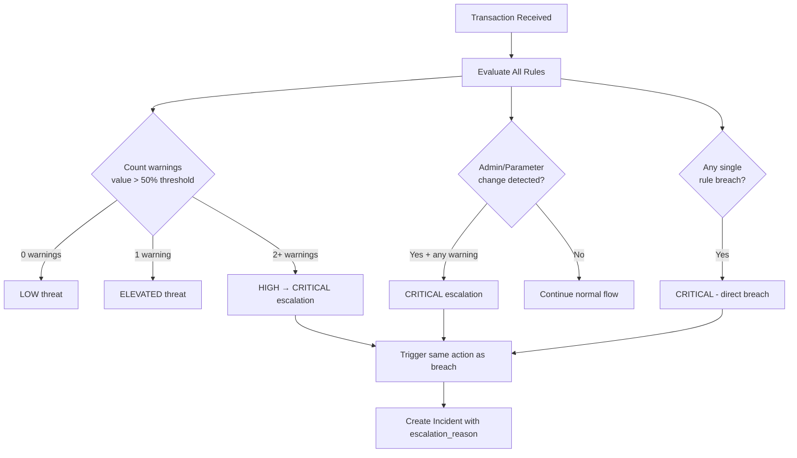
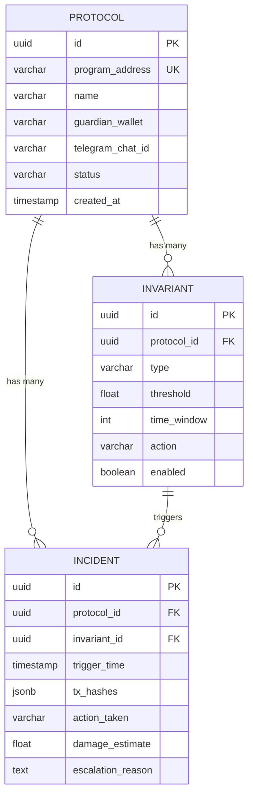

# Design Document — Killswitch Backend (Sentinel Service)

## Overview

Dokumen ini mendeskripsikan desain teknis untuk **Sentinel Service**, backend server dari Killswitch yang dibangun menggunakan **Python 3.12+ dan FastAPI** mengikuti pola clean architecture. Sentinel Service bertanggung jawab untuk:

- Menerima stream transaksi Solana secara real-time via Geyser/WebSocket
- Mengevaluasi setiap transaksi terhadap invariant rules yang dikonfigurasi
- Mendeteksi serangan multi-signal via severity escalation
- Memicu circuit breaker on-chain (Guardian Program) saat threshold dilanggar
- Mengirim alert ke Telegram
- Menyediakan REST API untuk dashboard frontend
- Menyediakan WebSocket untuk push update real-time
- Menjalankan simulasi replay serangan Drift hack dengan parameter yang adjustable

### Scope MVP (Hackathon)

Desain ini di-trim untuk fokus pada demo path hackathon:
- **3 entitas saja**: Protocol, Invariant, Incident (tanpa AlertConfig, tanpa Transaction entity)
- **Alert**: Telegram only (tanpa Discord, tanpa webhook)
- **Auth**: Wallet address sebagai identity, tanpa session token management
- **Invariant CRUD**: POST + GET only (tanpa PUT/DELETE)
- **Tanpa**: incident list/detail endpoints, monitoring status endpoint
- **Termasuk**: Severity escalation (multi-signal correlation), adjustable simulation parameters

### Keputusan Desain Utama

| Keputusan | Pilihan | Alasan |
|-----------|---------|--------|
| HTTP Framework | FastAPI | Async-native, auto-generated OpenAPI docs, Pydantic validation built-in, performa tinggi |
| ORM | SQLAlchemy 2.0 (async) | Mature, async support, flexible query builder, wide ecosystem |
| Migrations | Alembic | Standard migration tool untuk SQLAlchemy, version-controlled schema changes |
| Database | PostgreSQL | Relational data (protocol → invariants → incidents), JSONB support |
| Solana SDK | solders + solana-py | Python SDK paling mature untuk Solana |
| Real-time | FastAPI WebSocket | Native WebSocket support, async-compatible |
| Auth | Wallet-based (ed25519) | Crypto-native, tanpa Firebase/password, wallet address = identity |
| Alert | Telegram Bot API (httpx) | Async HTTP client, dimana protocol teams sudah ada, cukup untuk MVP |
| Architecture | Clean Architecture | Separation of concerns, testable, dependency injection via FastAPI Depends() |
| DI | FastAPI Depends() | Built-in dependency injection, deklaratif, type-safe |
| Validation | Pydantic v2 | Built into FastAPI, fast validation, serialization, settings management |
| Config | pydantic-settings | Type-safe env config, validation otomatis, .env file support |
| ASGI Server | Uvicorn | High-performance ASGI server, async-native |
| Testing | pytest + hypothesis | Property-based testing via hypothesis, fixtures via pytest |

## Architecture

### High-Level System Architecture



### Request Flow (REST API)



### Sentinel Monitoring Flow



### Severity Escalation Flow



### Dependency Injection Flow (FastAPI Depends)

FastAPI `Depends()` menginisialisasi semua dependency secara deklaratif:

```
Settings (pydantic-settings)
  └→ Database Engine + AsyncSession (SQLAlchemy async)
       └→ Clients
       │    ├→ Geyser Client (SOLANA_WS_URL)
       │    ├→ Solana RPC Client (SOLANA_RPC_URL, SENTINEL_KEYPAIR)
       │    └→ Telegram Client (TELEGRAM_BOT_TOKEN) via httpx
       └→ Repositories (injected with AsyncSession)
       │    ├→ Protocol Repository
       │    ├→ Invariant Repository
       │    └→ Incident Repository
       └→ WebSocket Manager
       └→ Services
       │    ├→ Protocol Service (ProtocolRepo, InvariantRepo)
       │    ├→ Invariant Service (InvariantRepo)
       │    ├→ Incident Service (IncidentRepo)
       │    ├→ Evaluator Service (InvariantRepo)
       │    ├→ Circuit Breaker Service (SolanaClient, ProtocolRepo, IncidentRepo)
       │    ├→ Telegram Dispatcher (TelegramClient)
       │    ├→ Sentinel Service (GeyserClient, Evaluator, CircuitBreaker, TelegramDispatcher, WSManager, ProtocolRepo)
       │    └→ Simulator Service (Evaluator)
       └→ Route Dependencies (via Depends())
            ├→ get_current_wallet → Auth dependency
            ├→ get_protocol_service → Protocol routes
            ├→ get_invariant_service → Invariant routes
            └→ get_simulator_service → Simulate routes
```

## Components and Interfaces

### Protocol Definitions (Python ABCs + Protocols)

Semua interface didefinisikan sebagai Python `Protocol` (typing) atau abstract base classes dan diimplementasikan oleh layer yang sesuai.

#### Client Interfaces

```python
# app/clients/geyser.py
from typing import Protocol, Callable, Awaitable
from dataclasses import dataclass
from datetime import datetime

@dataclass
class ParsedTransaction:
    """Representasi internal transaksi yang di-parse dari stream."""
    hash: str
    program_address: str
    instruction_type: str  # "transfer", "admin_change", "parameter_change", dll
    amount: float
    accounts: list[str]
    timestamp: datetime

class IGeyserClient(Protocol):
    async def connect(self) -> None: ...
    async def subscribe(self, program_address: str) -> None: ...
    async def unsubscribe(self, program_address: str) -> None: ...
    def on_transaction(self, callback: Callable[[ParsedTransaction], Awaitable[None]]) -> None: ...
    async def reconnect(self) -> None: ...
    async def close(self) -> None: ...

# app/clients/solana.py
class ISolanaClient(Protocol):
    async def trigger_pause(self, protocol_pda: str) -> str: ...
    async def resume(self, protocol_pda: str, guardian_signature: bytes) -> str: ...
    async def get_account_info(self, address: str) -> bytes: ...

# app/clients/telegram.py
class ITelegramClient(Protocol):
    async def send_message(self, chat_id: str, message: str) -> None: ...
```

#### Repository Interfaces

```python
# app/repositories/base.py
from typing import Protocol
from uuid import UUID
from app.models.protocol import Protocol as ProtocolModel
from app.models.invariant import Invariant
from app.models.incident import Incident

class IProtocolRepository(Protocol):
    async def create(self, protocol: ProtocolModel) -> ProtocolModel: ...
    async def find_by_id(self, id: UUID) -> ProtocolModel | None: ...
    async def find_by_guardian_wallet(self, wallet: str) -> list[ProtocolModel]: ...
    async def find_by_program_address(self, address: str) -> ProtocolModel | None: ...
    async def find_all_active(self) -> list[ProtocolModel]: ...
    async def update_status(self, id: UUID, status: str) -> None: ...

class IInvariantRepository(Protocol):
    async def create(self, invariant: Invariant) -> Invariant: ...
    async def find_by_id(self, id: UUID) -> Invariant | None: ...
    async def find_by_protocol_id(self, protocol_id: UUID) -> list[Invariant]: ...
    async def find_enabled_by_protocol_id(self, protocol_id: UUID) -> list[Invariant]: ...

class IIncidentRepository(Protocol):
    async def create(self, incident: Incident) -> Incident: ...
    async def find_by_id(self, id: UUID) -> Incident | None: ...
    async def find_by_protocol_id(self, protocol_id: UUID) -> list[Incident]: ...
```

#### Service Interfaces

```python
# app/services/interfaces.py
from typing import Protocol
from uuid import UUID
from dataclasses import dataclass
from app.clients.geyser import ParsedTransaction
from app.schemas.requests import RegisterProtocolRequest, CreateInvariantRequest, SimulationParams
from app.schemas.responses import ProtocolResponse, InvariantResponse, SimulationResult

@dataclass
class RuleResult:
    invariant_id: UUID
    invariant_type: str
    status: str  # "pass", "warning", "breach"
    measured_value: float
    threshold: float

@dataclass
class EvaluationResult:
    status: str           # "pass", "breach"
    threat_level: str     # "LOW", "ELEVATED", "HIGH", "CRITICAL"
    breached_rules: list[RuleResult]
    escalation_reason: str | None
    action: str           # "pause", "alert", or "" (no action)

class IProtocolService(Protocol):
    async def register_protocol(self, req: RegisterProtocolRequest, guardian_wallet: str) -> ProtocolResponse: ...
    async def get_protocol(self, id: UUID, guardian_wallet: str) -> ProtocolResponse: ...
    async def list_protocols(self, guardian_wallet: str) -> list[ProtocolResponse]: ...
    async def resume_protocol(self, id: UUID, guardian_wallet: str, signature: bytes) -> None: ...

class IInvariantService(Protocol):
    async def create_invariant(self, protocol_id: UUID, req: CreateInvariantRequest) -> InvariantResponse: ...
    async def list_invariants(self, protocol_id: UUID) -> list[InvariantResponse]: ...

class IEvaluator(Protocol):
    async def evaluate(self, tx: ParsedTransaction, protocol_id: UUID) -> EvaluationResult: ...

class ICircuitBreaker(Protocol):
    async def trigger_pause(self, protocol: ProtocolResponse, result: EvaluationResult, tx_hashes: list[str]) -> None: ...
    async def resume(self, protocol: ProtocolResponse, guardian_signature: bytes) -> None: ...

class ITelegramDispatcher(Protocol):
    async def dispatch_incident_alert(self, incident: dict, protocol: dict) -> None: ...
    async def dispatch_escalation_alert(self, incident: dict, protocol: dict, escalation_reason: str, contributing_rules: list[RuleResult]) -> None: ...
    async def dispatch_emergency_alert(self, protocol: dict, message: str) -> None: ...

class ISentinel(Protocol):
    async def start(self) -> None: ...
    async def stop(self) -> None: ...
    async def add_protocol(self, protocol: ProtocolResponse) -> None: ...
    async def remove_protocol(self, protocol_id: UUID) -> None: ...

class ISimulator(Protocol):
    async def run_drift_simulation(self, params: SimulationParams) -> SimulationResult: ...
```

### WebSocket Manager

```python
# app/ws/manager.py
from uuid import UUID
from fastapi import WebSocket
from dataclasses import dataclass, field
import asyncio
import json

@dataclass
class WebSocketManager:
    """Manages WebSocket connections per protocol."""
    connections: dict[UUID, set[WebSocket]] = field(default_factory=dict)
    _lock: asyncio.Lock = field(default_factory=asyncio.Lock)

    async def connect(self, protocol_id: UUID, websocket: WebSocket) -> None:
        """Register a WebSocket connection for a protocol."""
        await websocket.accept()
        async with self._lock:
            if protocol_id not in self.connections:
                self.connections[protocol_id] = set()
            self.connections[protocol_id].add(websocket)

    async def disconnect(self, protocol_id: UUID, websocket: WebSocket) -> None:
        """Remove a WebSocket connection."""
        async with self._lock:
            if protocol_id in self.connections:
                self.connections[protocol_id].discard(websocket)
                if not self.connections[protocol_id]:
                    del self.connections[protocol_id]

    async def broadcast_to_protocol(
        self, protocol_id: UUID, msg_type: str, data: dict
    ) -> None:
        """Broadcast message to all clients subscribed to a protocol."""
        message = json.dumps({"type": msg_type, "data": data})
        async with self._lock:
            clients = self.connections.get(protocol_id, set()).copy()
        
        disconnected = []
        for client in clients:
            try:
                await client.send_text(message)
            except Exception:
                disconnected.append(client)
        
        for client in disconnected:
            await self.disconnect(protocol_id, client)
```

### Desain Komponen Kunci

#### Evaluator Engine (dengan Severity Escalation)

Evaluator adalah komponen inti yang mengevaluasi setiap transaksi terhadap semua invariant rules aktif dan menghitung combined threat level:

```python
# app/services/evaluator.py
from typing import Callable, Awaitable

EvaluationStrategy = Callable[
    [ParsedTransaction, Invariant], Awaitable[RuleResult]
]

class EvaluatorService:
    def __init__(self, invariant_repo: IInvariantRepository):
        self.invariant_repo = invariant_repo
        self.strategies: dict[str, EvaluationStrategy] = {
            "WITHDRAWAL_RATE": self._eval_withdrawal_rate,
            "TVL_DROP": self._eval_tvl_drop,
            "ADMIN_KEY_CHANGE": self._eval_admin_key_change,
            "SINGLE_TX_SIZE": self._eval_single_tx_size,
            "PARAMETER_CHANGE": self._eval_parameter_change,
        }
```

**Alur evaluasi:**
1. Terima transaksi + protocol ID
2. Ambil semua invariant rules yang enabled untuk protocol
3. Evaluasi setiap rule → kumpulkan semua RuleResult
4. Hitung warning count (measured value > 50% threshold)
5. Tentukan combined threat level:
   - 0 warnings → LOW
   - 1 warning → ELEVATED
   - 2+ warnings → HIGH → escalate ke CRITICAL
   - Any single breach → CRITICAL
   - Admin/Parameter change + any warning → CRITICAL
6. Jika CRITICAL via escalation → return breach result dengan escalation_reason
7. Jika CRITICAL via direct breach → return breach result

**Strategy per tipe invariant:**
- `WITHDRAWAL_RATE`: Hitung total withdrawal dalam time_window → bandingkan threshold
- `TVL_DROP`: Hitung persentase penurunan TVL dalam time_window → bandingkan threshold
- `ADMIN_KEY_CHANGE`: Deteksi instruction type admin/authority change → breach jika terdeteksi
- `SINGLE_TX_SIZE`: Bandingkan tx.amount langsung dengan threshold
- `PARAMETER_CHANGE`: Deteksi instruction type parameter modification → breach jika terdeteksi

#### Simulator (dengan Adjustable Parameters)

Simulator memutar ulang data transaksi historis Drift hack melalui Evaluator:

```python
# app/services/simulator.py
class SimulatorService:
    def __init__(self, evaluator: IEvaluator):
        self.evaluator = evaluator
```

**Alur simulasi:**
1. Terima parameter (atau gunakan default): withdrawal_rate_threshold, withdrawal_rate_window, tvl_drop_threshold, tvl_drop_window
2. Buat temporary invariant rules dari parameter
3. Replay pre-configured Drift hack timeline events
4. Untuk setiap event, evaluasi melalui Evaluator
5. Catat timeline: timestamp, event, evaluation result, threat level, response action
6. Hitung summary: damage with/without Killswitch, amount saved
7. Return timeline + summary + rules yang digunakan

#### Geyser Client

```python
# app/clients/geyser.py
import asyncio
import websockets

class GeyserClient:
    def __init__(self, ws_url: str):
        self.ws_url = ws_url
        self.connection: websockets.WebSocketClientProtocol | None = None
        self.subscriptions: set[str] = set()
        self._callback: Callable[[ParsedTransaction], Awaitable[None]] | None = None
        self._reconnect_delay: float = 5.0  # Fixed 5-second delay per requirement
        self._running: bool = False
```

**Reconnection:** Fixed 5-second delay sesuai requirement 7.5.

#### Sentinel Service (Orchestrator)

```python
# app/services/sentinel.py
class SentinelService:
    def __init__(
        self,
        geyser: IGeyserClient,
        evaluator: IEvaluator,
        circuit_breaker: ICircuitBreaker,
        telegram_dispatcher: ITelegramDispatcher,
        ws_manager: WebSocketManager,
        protocol_repo: IProtocolRepository,
    ):
        self.geyser = geyser
        self.evaluator = evaluator
        self.circuit_breaker = circuit_breaker
        self.telegram_dispatcher = telegram_dispatcher
        self.ws_manager = ws_manager
        self.protocol_repo = protocol_repo
        self._task: asyncio.Task | None = None
```

**Alur kerja:**
1. `start()`: Load semua active protocols → subscribe ke Geyser → register callback
2. Callback `on_transaction()`:
   a. Evaluasi terhadap semua invariant rules (termasuk severity escalation)
   b. Jika CRITICAL + action "pause" → trigger circuit breaker → create incident → dispatch Telegram alert → broadcast via WS
   c. Jika breach + action "alert" → dispatch Telegram alert → broadcast via WS
   d. Jika pass → broadcast TX + threat level via WS
3. `stop()`: Cancel asyncio task → close Geyser connection

## Data Models

### SQLAlchemy Model Definitions

3 entitas saja untuk MVP: Protocol, Invariant, Incident.

#### Protocol Model

```python
# app/models/protocol.py
import uuid
from datetime import datetime
from sqlalchemy import String, DateTime, func
from sqlalchemy.dialects.postgresql import UUID
from sqlalchemy.orm import Mapped, mapped_column, relationship
from app.core.database import Base

class Protocol(Base):
    __tablename__ = "protocols"

    id: Mapped[uuid.UUID] = mapped_column(
        UUID(as_uuid=True), primary_key=True, default=uuid.uuid4
    )
    program_address: Mapped[str] = mapped_column(
        String(64), unique=True, nullable=False, index=True
    )
    name: Mapped[str] = mapped_column(String(255), nullable=False)
    guardian_wallet: Mapped[str] = mapped_column(
        String(64), nullable=False, index=True
    )
    telegram_chat_id: Mapped[str | None] = mapped_column(String(64), nullable=True)
    status: Mapped[str] = mapped_column(String(20), default="active")
    created_at: Mapped[datetime] = mapped_column(
        DateTime(timezone=True), server_default=func.now()
    )

    # Relationships
    invariants: Mapped[list["Invariant"]] = relationship(
        back_populates="protocol", cascade="all, delete-orphan"
    )
    incidents: Mapped[list["Incident"]] = relationship(
        back_populates="protocol", cascade="all, delete-orphan"
    )
```

#### Invariant Model

```python
# app/models/invariant.py
import uuid
from sqlalchemy import String, Float, Integer, Boolean, ForeignKey
from sqlalchemy.dialects.postgresql import UUID
from sqlalchemy.orm import Mapped, mapped_column, relationship
from app.core.database import Base

class Invariant(Base):
    __tablename__ = "invariants"

    id: Mapped[uuid.UUID] = mapped_column(
        UUID(as_uuid=True), primary_key=True, default=uuid.uuid4
    )
    protocol_id: Mapped[uuid.UUID] = mapped_column(
        UUID(as_uuid=True), ForeignKey("protocols.id", ondelete="CASCADE"),
        nullable=False, index=True
    )
    type: Mapped[str] = mapped_column(String(50), nullable=False)
    threshold: Mapped[float] = mapped_column(Float, nullable=False)
    time_window: Mapped[int] = mapped_column(Integer, nullable=False)
    action: Mapped[str] = mapped_column(String(20), nullable=False)  # "pause" or "alert"
    enabled: Mapped[bool] = mapped_column(Boolean, default=True)

    # Relationships
    protocol: Mapped["Protocol"] = relationship(back_populates="invariants")
```

#### Incident Model

```python
# app/models/incident.py
import uuid
from datetime import datetime
from sqlalchemy import String, Float, DateTime, Text, ForeignKey
from sqlalchemy.dialects.postgresql import UUID, JSONB
from sqlalchemy.orm import Mapped, mapped_column, relationship
from app.core.database import Base

class Incident(Base):
    __tablename__ = "incidents"

    id: Mapped[uuid.UUID] = mapped_column(
        UUID(as_uuid=True), primary_key=True, default=uuid.uuid4
    )
    protocol_id: Mapped[uuid.UUID] = mapped_column(
        UUID(as_uuid=True), ForeignKey("protocols.id", ondelete="CASCADE"),
        nullable=False, index=True
    )
    invariant_id: Mapped[uuid.UUID] = mapped_column(
        UUID(as_uuid=True), ForeignKey("invariants.id"), nullable=False
    )
    trigger_time: Mapped[datetime] = mapped_column(
        DateTime(timezone=True), nullable=False
    )
    tx_hashes: Mapped[list] = mapped_column(JSONB, default=list)
    action_taken: Mapped[str] = mapped_column(String(20), nullable=False)
    damage_estimate: Mapped[float] = mapped_column(Float, default=0.0)
    escalation_reason: Mapped[str | None] = mapped_column(Text, nullable=True)

    # Relationships
    protocol: Mapped["Protocol"] = relationship(back_populates="incidents")
    invariant: Mapped["Invariant"] = relationship()
```

### Database Schema (ER Diagram)



### Database Setup

```python
# app/core/database.py
from sqlalchemy.ext.asyncio import create_async_engine, async_sessionmaker, AsyncSession
from sqlalchemy.orm import DeclarativeBase

class Base(DeclarativeBase):
    pass

engine = None
async_session_factory = None

def init_db(database_url: str):
    """Initialize async SQLAlchemy engine and session factory."""
    global engine, async_session_factory
    engine = create_async_engine(database_url, echo=False, pool_pre_ping=True)
    async_session_factory = async_sessionmaker(engine, expire_on_commit=False)

async def get_session() -> AsyncSession:
    """Dependency for FastAPI — yields an async database session."""
    async with async_session_factory() as session:
        yield session
```

### Pydantic Schema Definitions

#### Request Schemas

```python
# app/schemas/requests.py
from pydantic import BaseModel, Field
from typing import Literal

class RegisterProtocolRequest(BaseModel):
    program_address: str = Field(..., min_length=1, max_length=64)
    name: str = Field(..., min_length=1, max_length=255)
    telegram_chat_id: str | None = None

class CreateInvariantRequest(BaseModel):
    type: Literal[
        "WITHDRAWAL_RATE", "TVL_DROP", "ADMIN_KEY_CHANGE",
        "SINGLE_TX_SIZE", "PARAMETER_CHANGE"
    ]
    threshold: float = Field(..., gt=0)
    time_window: int = Field(..., gt=0)
    action: Literal["pause", "alert"]

class VerifyWalletRequest(BaseModel):
    wallet_address: str = Field(..., min_length=1)
    message: str = Field(..., min_length=1)
    signature: str = Field(..., min_length=1)  # Base58-encoded ed25519 signature

class SimulationParams(BaseModel):
    withdrawal_rate_threshold: float | None = None  # Default: 5_000_000 ($5M)
    withdrawal_rate_window: int | None = None       # Default: 60 (1 minute)
    tvl_drop_threshold: float | None = None         # Default: 10.0 (10%)
    tvl_drop_window: int | None = None              # Default: 300 (5 minutes)
```

#### Response Schemas

```python
# app/schemas/responses.py
from pydantic import BaseModel
from uuid import UUID
from datetime import datetime
from typing import Any

class ProtocolResponse(BaseModel):
    id: UUID
    program_address: str
    name: str
    guardian_wallet: str
    telegram_chat_id: str | None
    status: str
    created_at: datetime
    invariants: list["InvariantResponse"] = []

    model_config = {"from_attributes": True}

class InvariantResponse(BaseModel):
    id: UUID
    protocol_id: UUID
    type: str
    threshold: float
    time_window: int
    action: str
    enabled: bool

    model_config = {"from_attributes": True}

class AuthResponse(BaseModel):
    wallet_address: str
    is_guardian: bool

class SimulationEvent(BaseModel):
    timestamp: datetime
    event_type: str
    description: str
    tx_details: str | None = None
    eval_result: str       # "pass", "warning", "breach"
    threat_level: str      # "LOW", "ELEVATED", "HIGH", "CRITICAL"
    response_action: str   # "monitor", "alert", "pause"
    cumulative_drain: float

class SimulationResult(BaseModel):
    timeline: list[SimulationEvent]
    damage_with_killswitch: float
    damage_without: float  # $285M
    amount_saved: float
    rules_used: list[InvariantResponse]

class APIResponse(BaseModel):
    """Standard API response envelope."""
    status: str  # "success" or "error"
    message: str
    data: Any = None
```

### API Response Helpers

```python
# app/api/response.py
from fastapi.responses import JSONResponse
from app.schemas.responses import APIResponse

def success_response(data: Any, message: str = "Success", status_code: int = 200) -> JSONResponse:
    return JSONResponse(
        status_code=status_code,
        content=APIResponse(status="success", message=message, data=data).model_dump(mode="json"),
    )

def error_response(message: str, status_code: int = 400) -> JSONResponse:
    return JSONResponse(
        status_code=status_code,
        content=APIResponse(status="error", message=message, data=None).model_dump(mode="json"),
    )
```

### Route Registration

```
Public Routes:
  GET  /api/health                        → Health check
  GET  /api/simulate/drift                → Drift hack simulation (adjustable params)
  POST /api/auth/verify                   → Verify wallet signature

Protected Routes (Wallet Auth Dependency):
  POST /api/protocols                     → Register protocol
  GET  /api/protocols                     → List protocols by guardian wallet
  GET  /api/protocols/{id}                → Get protocol detail + invariants
  POST /api/protocols/{id}/invariants     → Add invariant rule
  GET  /api/protocols/{id}/invariants     → List invariant rules
  POST /api/protocols/{id}/resume         → Resume paused protocol

WebSocket:
  ws://host/ws?protocol_id=ID            → Real-time TX feed + evaluation + threat level
```

### Configuration (pydantic-settings)

```python
# app/core/config.py
from pydantic_settings import BaseSettings, SettingsConfigDict

class Settings(BaseSettings):
    model_config = SettingsConfigDict(env_file=".env", env_file_encoding="utf-8")

    # Server
    app_port: int = 8000

    # Database
    postgres_user: str
    postgres_password: str
    postgres_db: str
    db_host: str = "localhost"
    db_port: int = 5432

    # Solana
    solana_rpc_url: str
    solana_ws_url: str
    guardian_program_id: str
    sentinel_keypair: str

    # Telegram
    telegram_bot_token: str
    telegram_chat_id: str

    # CORS
    allowed_origins: str = "http://localhost:3000"

    @property
    def database_url(self) -> str:
        return (
            f"postgresql+asyncpg://{self.postgres_user}:{self.postgres_password}"
            f"@{self.db_host}:{self.db_port}/{self.postgres_db}"
        )

    @property
    def cors_origins(self) -> list[str]:
        return [o.strip() for o in self.allowed_origins.split(",")]
```

## Correctness Properties

*A property is a characteristic or behavior that should hold true across all valid executions of a system — essentially, a formal statement about what the system should do. Properties serve as the bridge between human-readable specifications and machine-verifiable correctness guarantees.*

### Property 1: Missing Config Error Identification

*For any* required environment variable yang dihapus dari konfigurasi, config loader SHALL mengembalikan error yang mengandung nama variable yang hilang tersebut.

**Validates: Requirements 1.2**

### Property 2: Entity Database Round-Trip

*For any* valid entity (Protocol, Invariant, Incident) dengan field yang valid — termasuk Incident dengan dan tanpa escalation_reason — menyimpan entity ke database lalu membacanya kembali berdasarkan ID SHALL menghasilkan entity dengan semua field yang identik dengan entity asli.

**Validates: Requirements 3.1, 3.2, 3.3**

### Property 3: Ed25519 Signature Verification

*For any* ed25519 keypair dan message string, menandatangani message dengan private key lalu memverifikasi signature dengan public key SHALL menghasilkan verifikasi yang valid. Sebaliknya, *for any* signature yang dimodifikasi (bahkan 1 byte), verifikasi SHALL gagal.

**Validates: Requirements 4.1, 4.2**

### Property 4: Protocol Ownership Isolation

*For any* set of protocols yang terdaftar oleh berbagai guardian wallets, mengakses atau me-list protocols dengan wallet tertentu SHALL hanya mengembalikan protocols yang guardian_wallet-nya cocok dengan wallet tersebut. Wallet yang bukan guardian dari protocol manapun SHALL ditolak oleh auth dependency.

**Validates: Requirements 4.4, 5.3**

### Property 5: Protocol Address Uniqueness

*For any* program_address, mendaftarkan protocol kedua dengan program_address yang sama SHALL gagal dengan error conflict (409), terlepas dari nama, guardian wallet, atau telegram_chat_id yang berbeda.

**Validates: Requirements 5.2**

### Property 6: Invariant Input Validation

*For any* string yang merupakan anggota set {WITHDRAWAL_RATE, TVL_DROP, ADMIN_KEY_CHANGE, SINGLE_TX_SIZE, PARAMETER_CHANGE}, pembuatan invariant dengan threshold > 0 SHALL berhasil. *For any* string yang bukan anggota set tersebut, ATAU threshold ≤ 0, pembuatan invariant SHALL gagal dengan error 400.

**Validates: Requirements 6.2, 6.3, 6.4**

### Property 7: WITHDRAWAL_RATE Evaluation Correctness

*For any* sequence of withdrawal transactions dalam sebuah time window dan threshold yang dikonfigurasi, Evaluator SHALL mengembalikan "breach" jika dan hanya jika total jumlah withdrawal melebihi threshold. Nilai `measured_value` dalam hasil evaluasi SHALL sama dengan total jumlah withdrawal yang dihitung.

**Validates: Requirements 8.2**

### Property 8: TVL_DROP Evaluation Correctness

*For any* nilai TVL awal dan sequence of value changes dalam sebuah time window, Evaluator SHALL mengembalikan "breach" jika dan hanya jika persentase penurunan TVL melebihi threshold yang dikonfigurasi. Nilai `measured_value` SHALL sama dengan persentase penurunan yang dihitung.

**Validates: Requirements 8.3**

### Property 9: SINGLE_TX_SIZE Evaluation Correctness

*For any* transaksi dengan amount tertentu dan threshold yang dikonfigurasi, Evaluator SHALL mengembalikan "breach" jika dan hanya jika amount transaksi melebihi threshold.

**Validates: Requirements 8.5**

### Property 10: Severity Escalation and Threat Level Classification

*For any* set of rule evaluation results dimana setiap rule memiliki measured value dan threshold:
- Warning count SHALL sama dengan jumlah rules dimana measured value > 50% of threshold
- Threat level SHALL LOW jika 0 warnings, ELEVATED jika 1 warning, CRITICAL jika 2+ warnings (escalation)
- Jika ADMIN_KEY_CHANGE atau PARAMETER_CHANGE terdeteksi DAN minimal 1 rule lain dalam warning state, threat level SHALL CRITICAL
- Jika any single rule breach, threat level SHALL CRITICAL
- Saat escalation ke CRITICAL, result SHALL mengandung semua contributing rule IDs dan escalation reason

**Validates: Requirements 9.1, 9.2, 9.3, 9.4, 9.5**

### Property 11: Telegram Alert Message Completeness

*For any* incident dan protocol, pesan Telegram yang diformat SHALL mengandung: nama protocol, tipe incident, detail invariant yang dilanggar (tipe, measured value, threshold), aksi yang diambil, damage estimate, dan timestamp. *For any* incident yang dipicu oleh severity escalation, pesan SHALL juga mengandung escalation reason dan semua contributing rules.

**Validates: Requirements 11.2, 11.3**

### Property 12: Simulation Output Correctness

*For any* set of simulation parameters (atau default values), simulation result SHALL memenuhi: `amount_saved` = `damage_without` - `damage_with_killswitch`, `damage_without` = $285M (fixed), `damage_with_killswitch` < `damage_without`, setiap timeline entry mengandung timestamp, event description, evaluation result, threat level, dan response action, dan rules_used mencerminkan parameter yang diberikan (bukan default jika parameter di-override).

**Validates: Requirements 13.2, 13.3, 13.5**

### Property 13: API Response Envelope Consistency

*For any* API call yang berhasil, response body SHALL mengandung field `status` dengan nilai "success", field `message` berupa string, dan field `data` berupa object atau array. *For any* API call yang gagal, response body SHALL mengandung field `status` dengan nilai "error", field `message` berupa string deskriptif, dan field `data` dengan nilai null.

**Validates: Requirements 14.2, 14.3**

## Error Handling

### Error Strategy

Semua error menggunakan FastAPI `HTTPException` dan custom exception handlers:

```python
# app/core/exceptions.py
from fastapi import HTTPException

class AppError(HTTPException):
    """Custom application error with consistent structure."""
    def __init__(self, status_code: int, message: str, details: str | None = None):
        super().__init__(status_code=status_code, detail=message)
        self.message = message
        self.details = details
```

### Error Handling Strategy per Layer

| Layer | Strategy | Contoh |
|-------|----------|--------|
| **Route** | Pydantic auto-validates → call service → return response envelope | Validation error → 422 (auto), service error → forward HTTPException |
| **Service** | Business logic validation → call repo/client → raise HTTPException | Duplicate protocol → HTTPException(409), not found → HTTPException(404) |
| **Repository** | Database operations → wrap SQLAlchemy errors | Record not found → HTTPException(404), unique constraint → HTTPException(409) |
| **Client** | External service calls → wrap errors with context | Geyser disconnect → log + reconnect, Solana TX fail → HTTPException(502) |
| **Dependency** | Auth validation → raise HTTPException(401) | Missing wallet header → 401, wallet not guardian → 401 |

### Error Recovery

| Komponen | Error Scenario | Recovery Strategy |
|----------|---------------|-------------------|
| **Geyser Client** | WebSocket disconnect | Reconnect setelah 5 detik (fixed delay per Req 7.5) |
| **Circuit Breaker** | On-chain TX gagal | Log error + dispatch emergency Telegram alert (Req 10.5) |
| **Telegram Client** | API call gagal | Log failure (Req 11.4), tidak retry — lanjut proses |
| **Evaluator** | DB query gagal | Return error → Sentinel logs + skip TX (don't crash) |
| **WebSocket Manager** | Client disconnect | Remove dari connections dict + release resources (Req 12.4) |
| **Route Handler** | Unhandled exception | FastAPI exception handler → log + return 500 |

### HTTP Status Code Mapping

| Status Code | Kapan Digunakan |
|-------------|----------------|
| **200** | GET requests berhasil |
| **201** | POST creation berhasil (protocol, invariant) |
| **400** | Validation errors (invalid invariant type, threshold ≤ 0) |
| **401** | Auth errors (invalid signature, wallet bukan guardian) |
| **404** | Resource not found |
| **409** | Conflict (duplicate program_address) |
| **422** | Pydantic validation errors (auto dari FastAPI) |
| **500** | Internal server errors |

### Logging Strategy

Menggunakan Python `logging` module dengan structured logging:

```python
# app/core/logging.py
import logging
import sys

def setup_logging(level: str = "INFO") -> None:
    logging.basicConfig(
        level=getattr(logging, level.upper()),
        format="%(asctime)s | %(levelname)-8s | %(name)s | %(message)s",
        handlers=[logging.StreamHandler(sys.stdout)],
    )
```

| Level | Kapan Digunakan |
|-------|----------------|
| **ERROR** | Circuit breaker gagal, Telegram dispatch gagal, unhandled exception |
| **WARNING** | Geyser reconnect, invariant evaluation warning (mendekati threshold) |
| **INFO** | Server start/stop, protocol registered, breach detected, incident created, alert sent, Geyser connected |
| **DEBUG** | Setiap TX dievaluasi, WebSocket client connect/disconnect, threat level changes |

## Testing Strategy

### Pendekatan Dual Testing

Testing menggunakan kombinasi **unit tests** dan **property-based tests** untuk coverage yang komprehensif:

- **Unit tests**: Verifikasi contoh spesifik, edge cases, error conditions, dan integration points
- **Property-based tests**: Verifikasi universal properties yang harus berlaku untuk semua input valid
- Keduanya saling melengkapi: unit tests menangkap bug konkret, property tests memverifikasi kebenaran umum

### Property-Based Testing

**Library**: [hypothesis](https://hypothesis.readthedocs.io/) — property-based testing library untuk Python

**Konfigurasi**: Minimum 100 iterasi per property test (`@settings(max_examples=100)`)

**Tag format**: `Feature: killswitch-backend, Property {number}: {property_text}`

Property-based tests akan diimplementasikan untuk semua 13 correctness properties yang didefinisikan di atas. Setiap property test menggunakan `@given()` decorator dengan strategies untuk menghasilkan input acak dan memverifikasi bahwa property berlaku untuk semua input tersebut.

### Test Coverage per Komponen

| Komponen | Unit Tests | Property Tests | Integration Tests |
|----------|-----------|---------------|-------------------|
| **Config (Settings)** | Missing var error messages | Property 1: missing var identification | — |
| **Models** | Field mapping, relationships | Property 2: DB round-trip (Protocol, Invariant, Incident) | DB migration smoke test |
| **Auth Route** | Specific valid/invalid signatures | Property 3: ed25519 verification | — |
| **Auth Dependency** | Specific wallet scenarios | Property 4: ownership isolation | — |
| **Protocol Service** | CRUD operations, error cases | Property 4: ownership isolation, Property 5: address uniqueness | — |
| **Invariant Service** | Create + list operations | Property 6: input validation (type + threshold) | — |
| **Evaluator** | Specific breach/pass scenarios, admin/parameter detection | Property 7: withdrawal rate, Property 8: TVL drop, Property 9: single TX size, Property 10: severity escalation | — |
| **Telegram Dispatcher** | Format verification, failure handling | Property 11: message completeness (normal + escalation) | Telegram API integration |
| **Simulator** | Timeline completeness, default params | Property 12: output correctness (damage calc + param override) | — |
| **API Response** | Specific status codes | Property 13: envelope consistency | — |
| **WebSocket Manager** | Connect/disconnect, broadcast | — | Connection lifecycle |
| **Geyser Client** | — | — | Connection, subscription, reconnect |
| **Circuit Breaker** | — | — | On-chain TX mock |
| **Sentinel** | — | — | End-to-end flow mock |

### Unit Test Focus Areas

Unit tests fokus pada:
- **Contoh spesifik**: Skenario konkret (seed data, health check, default simulation)
- **Edge cases**: Empty input, None values, boundary values (threshold = 0)
- **Error conditions**: Invalid input, missing data, service failures, Telegram failures
- **Detection logic**: Admin key change detection, parameter change detection
- **Integration points**: Route → Service → Repository wiring

### Test Infrastructure

- **Database**: PostgreSQL test container via `testcontainers-python` atau SQLite in-memory untuk unit tests
- **External services**: Mock semua external clients (Geyser, Solana RPC, Telegram) menggunakan `unittest.mock` atau `pytest-mock`
- **WebSocket**: Gunakan `httpx` + FastAPI `TestClient` untuk WebSocket tests
- **HTTP**: Gunakan FastAPI `TestClient` (berbasis httpx) untuk route tests
- **Fixtures**: pytest fixtures untuk database session, mock clients, dan test data
- **Async**: `pytest-asyncio` untuk testing async functions

### Contoh Test Structure

```python
# tests/test_evaluator.py
import pytest
from hypothesis import given, settings, strategies as st

@settings(max_examples=100)
@given(
    amounts=st.lists(st.floats(min_value=0, max_value=1e9), min_size=1, max_size=20),
    threshold=st.floats(min_value=1, max_value=1e9),
)
def test_withdrawal_rate_breach_iff_total_exceeds_threshold(amounts, threshold):
    """Feature: killswitch-backend, Property 7: WITHDRAWAL_RATE Evaluation Correctness"""
    # Arrange
    total = sum(amounts)
    
    # Act
    result = evaluate_withdrawal_rate(amounts, threshold)
    
    # Assert
    if total > threshold:
        assert result.status == "breach"
        assert result.measured_value == pytest.approx(total)
    else:
        assert result.status == "pass"
```