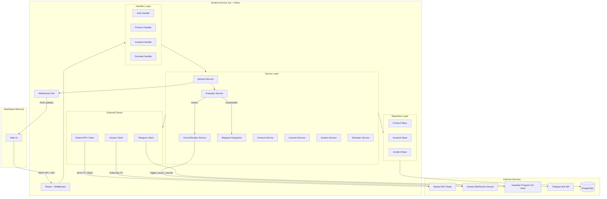
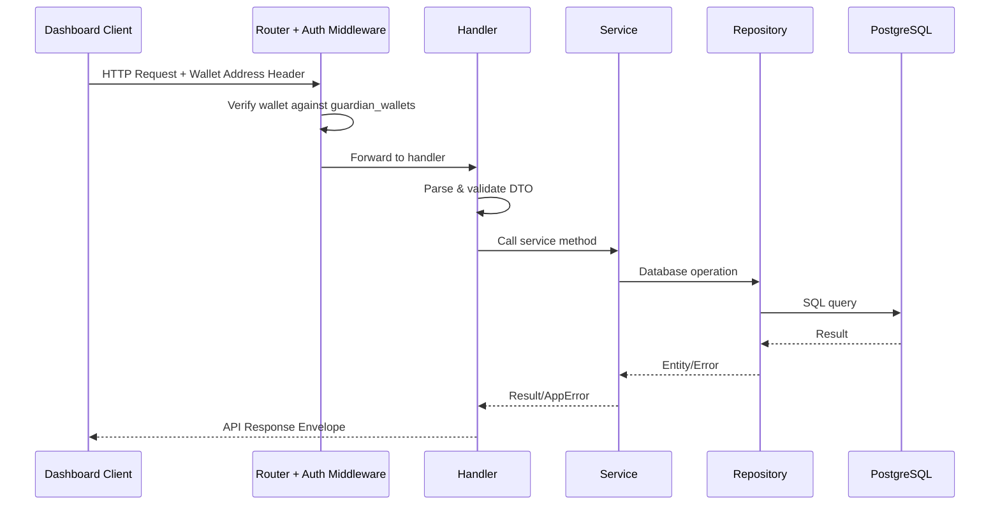
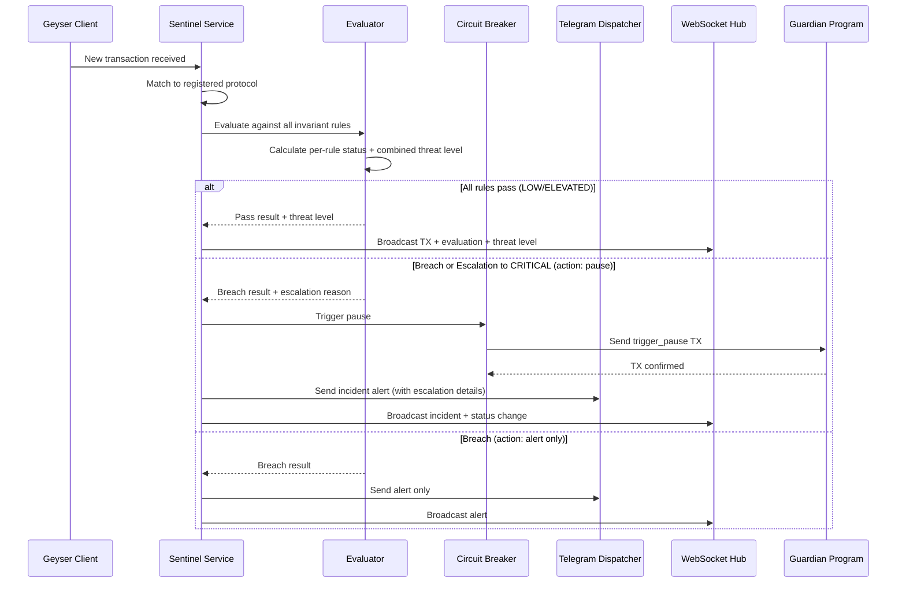
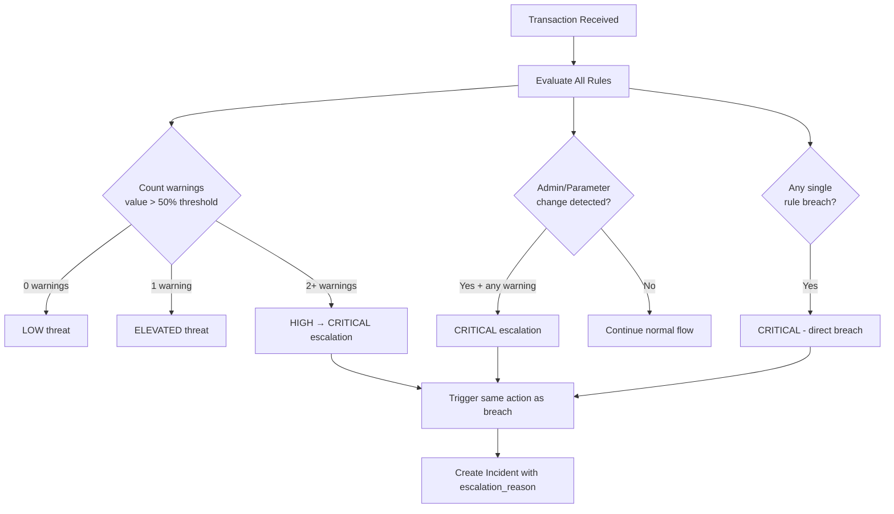
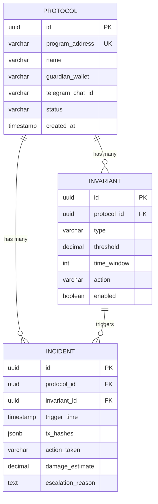

# Design Document — Killswitch Backend (Sentinel Service)

## Overview

Dokumen ini mendeskripsikan desain teknis untuk **Sentinel Service**, backend server dari Killswitch yang dibangun menggunakan Go + Fiber mengikuti pola clean architecture. Sentinel Service bertanggung jawab untuk:

- Menerima stream transaksi Solana secara real-time via Geyser/WebSocket
- Mengevaluasi setiap transaksi terhadap invariant rules yang dikonfigurasi
- Mendeteksi serangan multi-signal via severity escalation
- Memicu circuit breaker on-chain (Guardian Program) saat threshold dilanggar
- Mengirim alert ke Telegram
- Menyediakan REST API untuk dashboard frontend
- Menyediakan WebSocket untuk push update real-time
- Menjalankan simulasi replay serangan Drift hack dengan parameter yang adjustable

### Scope MVP (Hackathon)

Desain ini di-trim untuk fokus pada demo path hackathon:
- **3 entitas saja**: Protocol, Invariant, Incident (tanpa AlertConfig, tanpa Transaction entity)
- **Alert**: Telegram only (tanpa Discord, tanpa webhook)
- **Auth**: Wallet address sebagai identity, tanpa session token management
- **Invariant CRUD**: POST + GET only (tanpa PUT/DELETE)
- **Tanpa**: incident list/detail endpoints, monitoring status endpoint
- **Termasuk**: Severity escalation (multi-signal correlation), adjustable simulation parameters

### Keputusan Desain Utama

| Keputusan | Pilihan | Alasan |
|-----------|---------|--------|
| HTTP Framework | Fiber v2 | Performa tinggi, API mirip Express, konsisten dengan Miora |
| ORM | GORM | Auto-migrate, query builder, konsisten dengan Miora |
| Database | PostgreSQL | Relational data (protocol → invariants → incidents), JSONB support |
| Solana SDK | solana-go (gagliardetto) | Go SDK paling mature untuk Solana |
| Real-time | WebSocket (Fiber) | Push update ke dashboard tanpa polling |
| Auth | Wallet-based (ed25519) | Crypto-native, tanpa Firebase/password, wallet address = identity |
| Alert | Telegram Bot API | Dimana protocol teams sudah ada, cukup untuk MVP |
| Architecture | Clean Architecture | Separation of concerns, testable, konsisten dengan Miora |
| DI | Manual DI Container | Sederhana, eksplisit, tanpa framework DI |

## Architecture

### High-Level System Architecture



### Request Flow (REST API)



### Sentinel Monitoring Flow



### Severity Escalation Flow



### Dependency Injection Flow

DI Container di `router/container.go` menginisialisasi semua dependency dalam urutan yang benar:

```
Config
  └→ Database Connection (GORM)
       └→ Clients
       │    ├→ Geyser Client (SOLANA_WS_URL)
       │    ├→ Solana RPC Client (SOLANA_RPC_URL, SENTINEL_KEYPAIR)
       │    └→ Telegram Client (TELEGRAM_BOT_TOKEN)
       └→ Repositories
       │    ├→ Protocol Repository (DB)
       │    ├→ Invariant Repository (DB)
       │    └→ Incident Repository (DB)
       └→ WebSocket Hub
       └→ Services
       │    ├→ Protocol Service (ProtocolRepo, InvariantRepo)
       │    ├→ Invariant Service (InvariantRepo)
       │    ├→ Incident Service (IncidentRepo)
       │    ├→ Evaluator Service (InvariantRepo)
       │    ├→ Circuit Breaker Service (SolanaClient, ProtocolRepo, IncidentRepo)
       │    ├→ Telegram Dispatcher (TelegramClient)
       │    ├→ Sentinel Service (GeyserClient, Evaluator, CircuitBreaker, TelegramDispatcher, WSHub, ProtocolRepo)
       │    └→ Simulator Service (Evaluator)
       └→ Handlers
            ├→ Auth Handler (ProtocolRepo)
            ├→ Protocol Handler (ProtocolService)
            ├→ Invariant Handler (InvariantService)
            └→ Simulate Handler (SimulatorService)
```

## Components and Interfaces

### Interface Definitions

Semua interface didefinisikan di `app/interfaces/` dan diimplementasikan oleh layer yang sesuai.

#### Client Interfaces

```go
// interfaces/geyser.go
type IGeyserClient interface {
    Connect(ctx context.Context) error
    Subscribe(programAddress string) error
    Unsubscribe(programAddress string) error
    OnTransaction(callback func(tx *ParsedTransaction))
    Reconnect(ctx context.Context) error
    Close() error
}

// ParsedTransaction adalah representasi internal transaksi yang di-parse dari stream
type ParsedTransaction struct {
    Hash            string
    ProgramAddress  string
    InstructionType string    // "transfer", "admin_change", "parameter_change", dll
    Amount          float64
    Accounts        []string
    Timestamp       time.Time
}

// interfaces/solana.go
type ISolanaClient interface {
    TriggerPause(ctx context.Context, protocolPDA string) (string, error)
    Resume(ctx context.Context, protocolPDA string, guardianSignature []byte) (string, error)
    GetAccountInfo(ctx context.Context, address string) ([]byte, error)
}

// interfaces/telegram.go
type ITelegramClient interface {
    SendMessage(chatID string, message string) error
}
```

#### Repository Interfaces

```go
// interfaces/protocol_repository.go
type IProtocolRepository interface {
    Create(protocol *entities.Protocol) error
    FindByID(id uuid.UUID) (*entities.Protocol, error)
    FindByGuardianWallet(wallet string) ([]entities.Protocol, error)
    FindByProgramAddress(address string) (*entities.Protocol, error)
    FindAllActive() ([]entities.Protocol, error)
    UpdateStatus(id uuid.UUID, status string) error
}

// interfaces/invariant_repository.go
type IInvariantRepository interface {
    Create(invariant *entities.Invariant) error
    FindByID(id uuid.UUID) (*entities.Invariant, error)
    FindByProtocolID(protocolID uuid.UUID) ([]entities.Invariant, error)
    FindEnabledByProtocolID(protocolID uuid.UUID) ([]entities.Invariant, error)
}

// interfaces/incident_repository.go
type IIncidentRepository interface {
    Create(incident *entities.Incident) error
    FindByID(id uuid.UUID) (*entities.Incident, error)
    FindByProtocolID(protocolID uuid.UUID) ([]entities.Incident, error)
}
```

#### Service Interfaces

```go
// interfaces/protocol_service.go
type IProtocolService interface {
    RegisterProtocol(req *requests.RegisterProtocolRequest, guardianWallet string) (*entities.Protocol, error)
    GetProtocol(id uuid.UUID, guardianWallet string) (*entities.Protocol, error)
    ListProtocols(guardianWallet string) ([]entities.Protocol, error)
    ResumeProtocol(id uuid.UUID, guardianWallet string, signature []byte) error
}

// interfaces/invariant_service.go
type IInvariantService interface {
    CreateInvariant(protocolID uuid.UUID, req *requests.CreateInvariantRequest) (*entities.Invariant, error)
    ListInvariants(protocolID uuid.UUID) ([]entities.Invariant, error)
}

// interfaces/evaluator.go
type IEvaluator interface {
    Evaluate(ctx context.Context, tx *ParsedTransaction, protocolID uuid.UUID) (*EvaluationResult, error)
}

// EvaluationResult berisi hasil evaluasi termasuk severity escalation
type EvaluationResult struct {
    Status           string      // "pass", "breach"
    ThreatLevel      string      // "LOW", "ELEVATED", "HIGH", "CRITICAL"
    BreachedRules    []RuleResult // Semua rule yang breach atau warning
    EscalationReason string      // Alasan escalation (jika ada)
    Action           string      // "pause", "alert", atau "" (no action)
}

type RuleResult struct {
    InvariantID   uuid.UUID
    InvariantType string
    Status        string  // "pass", "warning", "breach"
    MeasuredValue float64
    Threshold     float64
}

// interfaces/circuit_breaker.go
type ICircuitBreaker interface {
    TriggerPause(ctx context.Context, protocol *entities.Protocol, result *EvaluationResult, txHashes []string) (*entities.Incident, error)
    Resume(ctx context.Context, protocol *entities.Protocol, guardianSignature []byte) error
}

// interfaces/telegram_dispatcher.go
type ITelegramDispatcher interface {
    DispatchIncidentAlert(incident *entities.Incident, protocol *entities.Protocol) error
    DispatchEscalationAlert(incident *entities.Incident, protocol *entities.Protocol, escalationReason string, contributingRules []RuleResult) error
    DispatchEmergencyAlert(protocol *entities.Protocol, message string) error
}

// interfaces/sentinel.go
type ISentinel interface {
    Start(ctx context.Context) error
    Stop() error
    AddProtocol(protocol *entities.Protocol) error
    RemoveProtocol(protocolID uuid.UUID) error
}

// interfaces/simulator.go
type ISimulator interface {
    RunDriftSimulation(params *requests.SimulationParams) (*responses.SimulationResult, error)
}
```

### WebSocket Hub

```go
// ws/hub.go
type Hub struct {
    clients    map[uuid.UUID]map[*Client]bool // protocol_id → set of clients
    register   chan *ClientRegistration
    unregister chan *Client
    broadcast  chan *BroadcastMessage
    mu         sync.RWMutex
}

type Client struct {
    ProtocolID uuid.UUID
    Conn       *websocket.Conn
    Send       chan []byte
}

type BroadcastMessage struct {
    ProtocolID uuid.UUID
    Type       string      // "transaction", "incident", "status_change"
    Data       interface{}
}

func (h *Hub) Run()
func (h *Hub) RegisterClient(protocolID uuid.UUID, conn *websocket.Conn)
func (h *Hub) UnregisterClient(client *Client)
func (h *Hub) BroadcastToProtocol(protocolID uuid.UUID, msgType string, data interface{})
```

### Desain Komponen Kunci

#### Evaluator Engine (dengan Severity Escalation)

Evaluator adalah komponen inti yang mengevaluasi setiap transaksi terhadap semua invariant rules aktif dan menghitung combined threat level:

```go
// services/evaluator.go
type evaluationStrategy func(ctx context.Context, tx *ParsedTransaction, inv *entities.Invariant) (*RuleResult, error)

type EvaluatorService struct {
    invariantRepo interfaces.IInvariantRepository
    strategies    map[string]evaluationStrategy
}
```

**Alur evaluasi:**
1. Terima transaksi + protocol ID
2. Ambil semua invariant rules yang enabled untuk protocol
3. Evaluasi setiap rule → kumpulkan semua RuleResult
4. Hitung warning count (measured value > 50% threshold)
5. Tentukan combined threat level:
   - 0 warnings → LOW
   - 1 warning → ELEVATED
   - 2+ warnings → HIGH → escalate ke CRITICAL
   - Any single breach → CRITICAL
   - Admin/Parameter change + any warning → CRITICAL
6. Jika CRITICAL via escalation → return breach result dengan escalation_reason
7. Jika CRITICAL via direct breach → return breach result

**Strategy per tipe invariant:**
- `WITHDRAWAL_RATE`: Hitung total withdrawal dalam time_window → bandingkan threshold
- `TVL_DROP`: Hitung persentase penurunan TVL dalam time_window → bandingkan threshold
- `ADMIN_KEY_CHANGE`: Deteksi instruction type admin/authority change → breach jika terdeteksi
- `SINGLE_TX_SIZE`: Bandingkan tx.Amount langsung dengan threshold
- `PARAMETER_CHANGE`: Deteksi instruction type parameter modification → breach jika terdeteksi

#### Simulator (dengan Adjustable Parameters)

Simulator memutar ulang data transaksi historis Drift hack melalui Evaluator:

```go
// services/simulator.go
type SimulatorService struct {
    evaluator interfaces.IEvaluator
}
```

**Alur simulasi:**
1. Terima parameter (atau gunakan default): withdrawal_rate_threshold, withdrawal_rate_window, tvl_drop_threshold, tvl_drop_window
2. Buat temporary invariant rules dari parameter
3. Replay pre-configured Drift hack timeline events
4. Untuk setiap event, evaluasi melalui Evaluator
5. Catat timeline: timestamp, event, evaluation result, threat level, response action
6. Hitung summary: damage with/without Killswitch, amount saved
7. Return timeline + summary + rules yang digunakan

#### Geyser Client

```go
// clients/geyser.go
type GeyserClient struct {
    wsURL          string
    conn           *websocket.Conn
    subscriptions  map[string]bool
    callback       func(tx *ParsedTransaction)
    mu             sync.RWMutex
    reconnectDelay time.Duration // 5 detik (fixed per requirement)
}
```

**Reconnection:** Fixed 5-second delay sesuai requirement 7.5.

#### Sentinel Service (Orchestrator)

```go
// services/sentinel.go
type SentinelService struct {
    geyser              interfaces.IGeyserClient
    evaluator           interfaces.IEvaluator
    circuitBreaker      interfaces.ICircuitBreaker
    telegramDispatcher  interfaces.ITelegramDispatcher
    wsHub               *ws.Hub
    protocolRepo        interfaces.IProtocolRepository
    ctx                 context.Context
    cancel              context.CancelFunc
}
```

**Alur kerja:**
1. `Start()`: Load semua active protocols → subscribe ke Geyser → register callback
2. Callback `onTransaction()`:
   a. Evaluasi terhadap semua invariant rules (termasuk severity escalation)
   b. Jika CRITICAL + action "pause" → trigger circuit breaker → create incident → dispatch Telegram alert → broadcast via WS
   c. Jika breach + action "alert" → dispatch Telegram alert → broadcast via WS
   d. Jika pass → broadcast TX + threat level via WS
3. `Stop()`: Cancel context → close Geyser connection

## Data Models

### Entity Definitions (GORM)

3 entitas saja untuk MVP: Protocol, Invariant, Incident.

#### Protocol Entity

```go
// entities/protocol.go
type Protocol struct {
    ID              uuid.UUID   `gorm:"type:uuid;primaryKey;default:gen_random_uuid()" json:"id"`
    ProgramAddress  string      `gorm:"type:varchar(64);uniqueIndex;not null" json:"program_address"`
    Name            string      `gorm:"type:varchar(255);not null" json:"name"`
    GuardianWallet  string      `gorm:"type:varchar(64);not null;index" json:"guardian_wallet"`
    TelegramChatID  string      `gorm:"type:varchar(64)" json:"telegram_chat_id"`
    Status          string      `gorm:"type:varchar(20);default:'active'" json:"status"` // "active", "paused"
    CreatedAt       time.Time   `gorm:"autoCreateTime" json:"created_at"`
    
    // Associations
    Invariants      []Invariant `gorm:"foreignKey:ProtocolID;constraint:OnDelete:CASCADE" json:"invariants,omitempty"`
    Incidents       []Incident  `gorm:"foreignKey:ProtocolID;constraint:OnDelete:CASCADE" json:"incidents,omitempty"`
}
```

#### Invariant Entity

```go
// entities/invariant.go
type Invariant struct {
    ID         uuid.UUID `gorm:"type:uuid;primaryKey;default:gen_random_uuid()" json:"id"`
    ProtocolID uuid.UUID `gorm:"type:uuid;not null;index" json:"protocol_id"`
    Type       string    `gorm:"type:varchar(50);not null" json:"type"`
    Threshold  float64   `gorm:"type:decimal(20,6);not null" json:"threshold"`
    TimeWindow int       `gorm:"not null" json:"time_window"`
    Action     string    `gorm:"type:varchar(20);not null" json:"action"` // "pause" atau "alert"
    Enabled    bool      `gorm:"default:true" json:"enabled"`
    
    // Association
    Protocol   Protocol  `gorm:"foreignKey:ProtocolID" json:"-"`
}
```

#### Incident Entity

```go
// entities/incident.go
type Incident struct {
    ID               uuid.UUID      `gorm:"type:uuid;primaryKey;default:gen_random_uuid()" json:"id"`
    ProtocolID       uuid.UUID      `gorm:"type:uuid;not null;index" json:"protocol_id"`
    InvariantID      uuid.UUID      `gorm:"type:uuid;not null" json:"invariant_id"`
    TriggerTime      time.Time      `gorm:"not null" json:"trigger_time"`
    TxHashes         datatypes.JSON `gorm:"type:jsonb" json:"tx_hashes"`
    ActionTaken      string         `gorm:"type:varchar(20);not null" json:"action_taken"`
    DamageEstimate   float64        `gorm:"type:decimal(20,6);default:0" json:"damage_estimate"`
    EscalationReason *string        `gorm:"type:text" json:"escalation_reason"`
    
    // Associations
    Protocol         Protocol       `gorm:"foreignKey:ProtocolID" json:"protocol,omitempty"`
    Invariant        Invariant      `gorm:"foreignKey:InvariantID" json:"invariant,omitempty"`
}
```

### Database Schema (ER Diagram)



### DTO Definitions

#### Request DTOs

```go
// dto/requests/protocol.go
type RegisterProtocolRequest struct {
    ProgramAddress string `json:"program_address" validate:"required"`
    Name           string `json:"name" validate:"required,min=1,max=255"`
    TelegramChatID string `json:"telegram_chat_id"`
}

// dto/requests/invariant.go
type CreateInvariantRequest struct {
    Type       string  `json:"type" validate:"required,oneof=WITHDRAWAL_RATE TVL_DROP ADMIN_KEY_CHANGE SINGLE_TX_SIZE PARAMETER_CHANGE"`
    Threshold  float64 `json:"threshold" validate:"required,gt=0"`
    TimeWindow int     `json:"time_window" validate:"required,gt=0"`
    Action     string  `json:"action" validate:"required,oneof=pause alert"`
}

// dto/requests/auth.go
type VerifyWalletRequest struct {
    WalletAddress string `json:"wallet_address" validate:"required"`
    Message       string `json:"message" validate:"required"`
    Signature     string `json:"signature" validate:"required"` // Base58-encoded ed25519 signature
}

// dto/requests/simulate.go
type SimulationParams struct {
    WithdrawalRateThreshold *float64 `query:"withdrawal_rate_threshold"` // Default: 5000000 ($5M)
    WithdrawalRateWindow    *int     `query:"withdrawal_rate_window"`    // Default: 60 (1 menit)
    TVLDropThreshold        *float64 `query:"tvl_drop_threshold"`        // Default: 10.0 (10%)
    TVLDropWindow           *int     `query:"tvl_drop_window"`           // Default: 300 (5 menit)
}
```

#### Response DTOs

```go
// dto/responses/protocol.go
type ProtocolResponse struct {
    ID              uuid.UUID           `json:"id"`
    ProgramAddress  string              `json:"program_address"`
    Name            string              `json:"name"`
    GuardianWallet  string              `json:"guardian_wallet"`
    TelegramChatID  string              `json:"telegram_chat_id"`
    Status          string              `json:"status"`
    CreatedAt       time.Time           `json:"created_at"`
    Invariants      []InvariantResponse `json:"invariants,omitempty"`
}

// dto/responses/invariant.go
type InvariantResponse struct {
    ID         uuid.UUID `json:"id"`
    ProtocolID uuid.UUID `json:"protocol_id"`
    Type       string    `json:"type"`
    Threshold  float64   `json:"threshold"`
    TimeWindow int       `json:"time_window"`
    Action     string    `json:"action"`
    Enabled    bool      `json:"enabled"`
}

// dto/responses/auth.go
type AuthResponse struct {
    WalletAddress string `json:"wallet_address"`
    IsGuardian    bool   `json:"is_guardian"`
}

// dto/responses/simulate.go
type SimulationResult struct {
    Timeline             []SimulationEvent `json:"timeline"`
    DamageWithKillswitch float64           `json:"damage_with_killswitch"`
    DamageWithout        float64           `json:"damage_without"` // $285M
    AmountSaved          float64           `json:"amount_saved"`
    RulesUsed            []InvariantResponse `json:"rules_used"`
}

type SimulationEvent struct {
    Timestamp       time.Time `json:"timestamp"`
    EventType       string    `json:"event_type"`
    Description     string    `json:"description"`
    TxDetails       string    `json:"tx_details,omitempty"`
    EvalResult      string    `json:"eval_result"`      // "pass", "warning", "breach"
    ThreatLevel     string    `json:"threat_level"`      // "LOW", "ELEVATED", "HIGH", "CRITICAL"
    ResponseAction  string    `json:"response_action"`   // "monitor", "alert", "pause"
    CumulativeDrain float64   `json:"cumulative_drain"`
}
```

### API Response Envelope

```go
// output/response.go
type APIResponse struct {
    Status  string      `json:"status"`  // "success" atau "error"
    Message string      `json:"message"`
    Data    interface{} `json:"data"`
}

func Success(c *fiber.Ctx, statusCode int, message string, data interface{}) error {
    return c.Status(statusCode).JSON(APIResponse{
        Status:  "success",
        Message: message,
        Data:    data,
    })
}

func Error(c *fiber.Ctx, statusCode int, message string) error {
    return c.Status(statusCode).JSON(APIResponse{
        Status:  "error",
        Message: message,
        Data:    nil,
    })
}
```

### Route Registration

```
Public Routes:
  GET  /api/health                        → Health check
  GET  /api/simulate/drift                → Drift hack simulation (adjustable params)
  POST /api/auth/verify                   → Verify wallet signature

Protected Routes (Wallet Auth Middleware):
  POST /api/protocols                     → Register protocol
  GET  /api/protocols                     → List protocols by guardian wallet
  GET  /api/protocols/:id                 → Get protocol detail + invariants
  POST /api/protocols/:id/invariants      → Add invariant rule
  GET  /api/protocols/:id/invariants      → List invariant rules
  POST /api/protocols/:id/resume          → Resume paused protocol

WebSocket:
  ws://host/ws?protocol_id=ID            → Real-time TX feed + evaluation + threat level
```


## Correctness Properties

*A property is a characteristic or behavior that should hold true across all valid executions of a system — essentially, a formal statement about what the system should do. Properties serve as the bridge between human-readable specifications and machine-verifiable correctness guarantees.*

### Property 1: Missing Config Error Identification

*For any* required environment variable yang dihapus dari konfigurasi, config loader SHALL mengembalikan error yang mengandung nama variable yang hilang tersebut.

**Validates: Requirements 1.2**

### Property 2: Entity Database Round-Trip

*For any* valid entity (Protocol, Invariant, Incident) dengan field yang valid — termasuk Incident dengan dan tanpa escalation_reason — menyimpan entity ke database lalu membacanya kembali berdasarkan ID SHALL menghasilkan entity dengan semua field yang identik dengan entity asli.

**Validates: Requirements 3.1, 3.2, 3.3**

### Property 3: Ed25519 Signature Verification

*For any* ed25519 keypair dan message string, menandatangani message dengan private key lalu memverifikasi signature dengan public key SHALL menghasilkan verifikasi yang valid. Sebaliknya, *for any* signature yang dimodifikasi (bahkan 1 byte), verifikasi SHALL gagal.

**Validates: Requirements 4.1, 4.2**

### Property 4: Protocol Ownership Isolation

*For any* set of protocols yang terdaftar oleh berbagai guardian wallets, mengakses atau me-list protocols dengan wallet tertentu SHALL hanya mengembalikan protocols yang guardian_wallet-nya cocok dengan wallet tersebut. Wallet yang bukan guardian dari protocol manapun SHALL ditolak oleh auth middleware.

**Validates: Requirements 4.4, 5.3**

### Property 5: Protocol Address Uniqueness

*For any* program_address, mendaftarkan protocol kedua dengan program_address yang sama SHALL gagal dengan error conflict (409), terlepas dari nama, guardian wallet, atau telegram_chat_id yang berbeda.

**Validates: Requirements 5.2**

### Property 6: Invariant Input Validation

*For any* string yang merupakan anggota set {WITHDRAWAL_RATE, TVL_DROP, ADMIN_KEY_CHANGE, SINGLE_TX_SIZE, PARAMETER_CHANGE}, pembuatan invariant dengan threshold > 0 SHALL berhasil. *For any* string yang bukan anggota set tersebut, ATAU threshold ≤ 0, pembuatan invariant SHALL gagal dengan error 400.

**Validates: Requirements 6.2, 6.3, 6.4**

### Property 7: WITHDRAWAL_RATE Evaluation Correctness

*For any* sequence of withdrawal transactions dalam sebuah time window dan threshold yang dikonfigurasi, Evaluator SHALL mengembalikan "breach" jika dan hanya jika total jumlah withdrawal melebihi threshold. Nilai `MeasuredValue` dalam hasil evaluasi SHALL sama dengan total jumlah withdrawal yang dihitung.

**Validates: Requirements 8.2**

### Property 8: TVL_DROP Evaluation Correctness

*For any* nilai TVL awal dan sequence of value changes dalam sebuah time window, Evaluator SHALL mengembalikan "breach" jika dan hanya jika persentase penurunan TVL melebihi threshold yang dikonfigurasi. Nilai `MeasuredValue` SHALL sama dengan persentase penurunan yang dihitung.

**Validates: Requirements 8.3**

### Property 9: SINGLE_TX_SIZE Evaluation Correctness

*For any* transaksi dengan amount tertentu dan threshold yang dikonfigurasi, Evaluator SHALL mengembalikan "breach" jika dan hanya jika amount transaksi melebihi threshold.

**Validates: Requirements 8.5**

### Property 10: Severity Escalation and Threat Level Classification

*For any* set of rule evaluation results dimana setiap rule memiliki measured value dan threshold:
- Warning count SHALL sama dengan jumlah rules dimana measured value > 50% of threshold
- Threat level SHALL LOW jika 0 warnings, ELEVATED jika 1 warning, CRITICAL jika 2+ warnings (escalation)
- Jika ADMIN_KEY_CHANGE atau PARAMETER_CHANGE terdeteksi DAN minimal 1 rule lain dalam warning state, threat level SHALL CRITICAL
- Jika any single rule breach, threat level SHALL CRITICAL
- Saat escalation ke CRITICAL, result SHALL mengandung semua contributing rule IDs dan escalation reason

**Validates: Requirements 9.1, 9.2, 9.3, 9.4, 9.5**

### Property 11: Telegram Alert Message Completeness

*For any* incident dan protocol, pesan Telegram yang diformat SHALL mengandung: nama protocol, tipe incident, detail invariant yang dilanggar (tipe, measured value, threshold), aksi yang diambil, damage estimate, dan timestamp. *For any* incident yang dipicu oleh severity escalation, pesan SHALL juga mengandung escalation reason dan semua contributing rules.

**Validates: Requirements 11.2, 11.3**

### Property 12: Simulation Output Correctness

*For any* set of simulation parameters (atau default values), simulation result SHALL memenuhi: `amount_saved` = `damage_without` - `damage_with_killswitch`, `damage_without` = $285M (fixed), `damage_with_killswitch` < `damage_without`, setiap timeline entry mengandung timestamp, event description, evaluation result, threat level, dan response action, dan rules_used mencerminkan parameter yang diberikan (bukan default jika parameter di-override).

**Validates: Requirements 13.2, 13.3, 13.5**

### Property 13: API Response Envelope Consistency

*For any* API call yang berhasil, response body SHALL mengandung field `status` dengan nilai "success", field `message` berupa string, dan field `data` berupa object atau array. *For any* API call yang gagal, response body SHALL mengandung field `status` dengan nilai "error", field `message` berupa string deskriptif, dan field `data` dengan nilai null.

**Validates: Requirements 14.2, 14.3**

## Error Handling

### Error Types

Semua error internal menggunakan `AppError` type dari `pkg/error.go`:

```go
// pkg/error.go
type AppError struct {
    StatusCode int    `json:"status_code"`
    Message    string `json:"message"`
    Details    string `json:"details,omitempty"`
}

func (e *AppError) Error() string {
    return e.Message
}

func NewAppError(statusCode int, message string) *AppError {
    return &AppError{StatusCode: statusCode, Message: message}
}

func NewAppErrorWithDetails(statusCode int, message string, details string) *AppError {
    return &AppError{StatusCode: statusCode, Message: message, Details: details}
}
```

### Error Handling Strategy per Layer

| Layer | Strategy | Contoh |
|-------|----------|--------|
| **Handler** | Parse request → validate → call service → return response envelope | Validation error → 400, service error → forward AppError |
| **Service** | Business logic validation → call repo/client → wrap errors as AppError | Duplicate protocol → AppError(409), not found → AppError(404) |
| **Repository** | Database operations → wrap GORM errors | Record not found → AppError(404), unique constraint → AppError(409) |
| **Client** | External service calls → wrap errors with context | Geyser disconnect → log + reconnect, Solana TX fail → AppError(502) |
| **Middleware** | Auth validation → return 401 if invalid | Missing wallet header → 401, wallet not guardian → 401 |

### Error Recovery

| Komponen | Error Scenario | Recovery Strategy |
|----------|---------------|-------------------|
| **Geyser Client** | WebSocket disconnect | Reconnect setelah 5 detik (fixed delay per Req 7.5) |
| **Circuit Breaker** | On-chain TX gagal | Log error + dispatch emergency Telegram alert (Req 10.5) |
| **Telegram Client** | API call gagal | Log failure (Req 11.4), tidak retry — lanjut proses |
| **Evaluator** | DB query gagal | Return error → Sentinel logs + skip TX (don't crash) |
| **WebSocket Hub** | Client disconnect | Remove dari map + release resources (Req 12.4) |
| **Handler** | Panic recovery | Fiber recover middleware → log + return 500 |

### HTTP Status Code Mapping

| Status Code | Kapan Digunakan |
|-------------|----------------|
| **200** | GET requests berhasil |
| **201** | POST creation berhasil (protocol, invariant) |
| **400** | Validation errors (invalid invariant type, threshold ≤ 0) |
| **401** | Auth errors (invalid signature, wallet bukan guardian) |
| **404** | Resource not found |
| **409** | Conflict (duplicate program_address) |
| **500** | Internal server errors |

### Logging Strategy

Menggunakan structured logging (Go `log/slog`) dengan level:

| Level | Kapan Digunakan |
|-------|----------------|
| **ERROR** | Circuit breaker gagal, Telegram dispatch gagal, unhandled panic |
| **WARN** | Geyser reconnect, invariant evaluation warning (mendekati threshold) |
| **INFO** | Server start/stop, protocol registered, breach detected, incident created, alert sent, Geyser connected |
| **DEBUG** | Setiap TX dievaluasi, WebSocket client connect/disconnect, threat level changes |

## Testing Strategy

### Pendekatan Dual Testing

Testing menggunakan kombinasi **unit tests** dan **property-based tests** untuk coverage yang komprehensif:

- **Unit tests**: Verifikasi contoh spesifik, edge cases, error conditions, dan integration points
- **Property-based tests**: Verifikasi universal properties yang harus berlaku untuk semua input valid
- Keduanya saling melengkapi: unit tests menangkap bug konkret, property tests memverifikasi kebenaran umum

### Property-Based Testing

**Library**: [rapid](https://github.com/flyingmutant/rapid) — property-based testing library untuk Go

**Konfigurasi**: Minimum 100 iterasi per property test

**Tag format**: `Feature: killswitch-backend, Property {number}: {property_text}`

Property-based tests akan diimplementasikan untuk semua 13 correctness properties yang didefinisikan di atas. Setiap property test menggunakan generator untuk menghasilkan input acak dan memverifikasi bahwa property berlaku untuk semua input tersebut.

### Test Coverage per Komponen

| Komponen | Unit Tests | Property Tests | Integration Tests |
|----------|-----------|---------------|-------------------|
| **Config Loader** | Missing var error messages | Property 1: missing var identification | — |
| **Entities** | Field mapping, associations | Property 2: DB round-trip (Protocol, Invariant, Incident) | DB migration smoke test |
| **Auth Handler** | Specific valid/invalid signatures | Property 3: ed25519 verification | — |
| **Auth Middleware** | Specific wallet scenarios | Property 4: ownership isolation | — |
| **Protocol Service** | CRUD operations, error cases | Property 4: ownership isolation, Property 5: address uniqueness | — |
| **Invariant Service** | Create + list operations | Property 6: input validation (type + threshold) | — |
| **Evaluator** | Specific breach/pass scenarios, admin/parameter detection | Property 7: withdrawal rate, Property 8: TVL drop, Property 9: single TX size, Property 10: severity escalation | — |
| **Telegram Dispatcher** | Format verification, failure handling | Property 11: message completeness (normal + escalation) | Telegram API integration |
| **Simulator** | Timeline completeness, default params | Property 12: output correctness (damage calc + param override) | — |
| **API Response** | Specific status codes | Property 13: envelope consistency | — |
| **WebSocket Hub** | Connect/disconnect, broadcast | — | Connection lifecycle |
| **Geyser Client** | — | — | Connection, subscription, reconnect |
| **Circuit Breaker** | — | — | On-chain TX mock |
| **Sentinel** | — | — | End-to-end flow mock |

### Unit Test Focus Areas

Unit tests fokus pada:
- **Contoh spesifik**: Skenario konkret (seed data, health check, default simulation)
- **Edge cases**: Empty input, nil values, boundary values (threshold = 0)
- **Error conditions**: Invalid input, missing data, service failures, Telegram failures
- **Detection logic**: Admin key change detection, parameter change detection
- **Integration points**: Handler → Service → Repository wiring

### Test Infrastructure

- **Database**: PostgreSQL test container atau SQLite in-memory untuk unit tests
- **External services**: Mock semua external clients (Geyser, Solana RPC, Telegram) menggunakan interface-based mocking
- **WebSocket**: Gunakan gorilla/websocket test utilities untuk WebSocket hub tests
- **HTTP**: Gunakan Fiber test utilities (`app.Test()`) untuk handler tests
