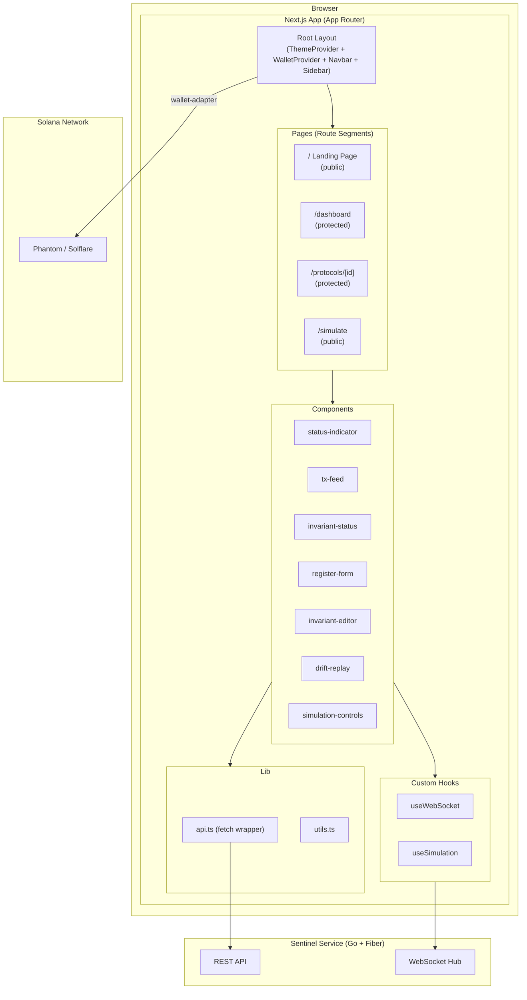
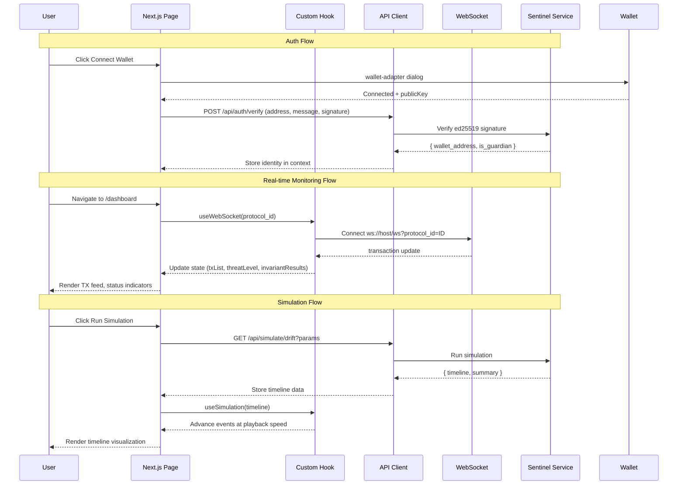
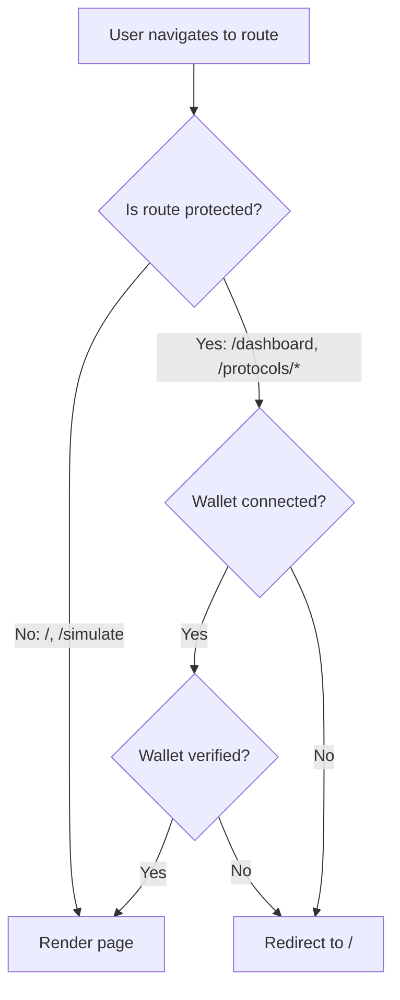

# Design Document — Killswitch Frontend Dashboard

## Overview

Dokumen ini mendeskripsikan desain teknis untuk **Killswitch Frontend Dashboard**, antarmuka web dari Killswitch yang dibangun menggunakan Next.js 16 (App Router) + TypeScript + Tailwind CSS v4 + shadcn/ui. Dashboard menyediakan:

- Landing page yang menjelaskan masalah Drift hack dan solusi Killswitch
- Wallet-based authentication (Phantom/Solflare) — connect wallet = login
- Dashboard monitoring real-time dengan WebSocket (TX feed, invariant status, threat level)
- Registrasi protokol dan konfigurasi invariant rules
- Simulasi visual Drift hack dengan parameter yang bisa disesuaikan dan playback controls

Scope di-trim untuk hackathon MVP — fokus pada demo path: landing → connect wallet → dashboard → protocol detail → simulate.

### Keputusan Desain Utama

| Keputusan | Pilihan | Alasan |
|-----------|---------|--------|
| Framework | Next.js 16 + App Router | Server components, file-based routing, konsisten dengan Miora |
| Styling | Tailwind CSS v4 | Utility-first, dark theme mudah, konsisten dengan Miora |
| Component Library | shadcn/ui | Composable, accessible, Tailwind-native |
| Wallet Integration | @solana/wallet-adapter | Standard Solana wallet SDK, support Phantom + Solflare |
| State Management | React hooks + context | Cukup untuk MVP, tanpa Redux/Zustand overhead |
| Real-time | Native WebSocket via custom hook | Langsung consume backend WS, tanpa library tambahan |
| Auth Model | Wallet address = identity | Crypto-native, tanpa Firebase/session token management |
| Theme | Dark-only | Crypto/security aesthetic, desktop-first |

## Architecture

### High-Level Frontend Architecture



### Data Flow Architecture



### Route Protection Flow



### Component Hierarchy

```
app/layout.tsx
├── ThemeProvider (dark theme)
│   └── WalletProvider (Phantom, Solflare — devnet)
│       ├── Navbar (logo + Connect Wallet button)
│       ├── Sidebar (conditional — hidden on landing/simulate)
│       └── {children}
│           ├── page.tsx (Landing)
│           ├── dashboard/page.tsx (Monitoring)
│           │   ├── StatusIndicator
│           │   ├── TxFeed
│           │   ├── InvariantStatus
│           │   └── CombinedThreatLevel
│           ├── protocols/[id]/page.tsx (Detail)
│           │   ├── ProtocolInfo
│           │   ├── InvariantList
│           │   ├── InvariantEditor
│           │   ├── RegisterForm (if no protocol)
│           │   └── ResumeButton (if paused)
│           └── simulate/page.tsx (Drift Simulation)
│               ├── SimulationControls
│               ├── DriftReplay (timeline)
│               └── SimulationSummary
```

## Components and Interfaces

### Provider Components

#### WalletProvider (`components/providers/wallet-provider.tsx`)

Wraps the app dengan `@solana/wallet-adapter-react` provider. Konfigurasi:
- Network: Solana devnet
- Wallets: Phantom, Solflare
- Auto-connect: disabled (user harus klik Connect)

```typescript
// Simplified interface
interface WalletProviderProps {
  children: React.ReactNode;
}
```

#### ThemeProvider (`components/providers/theme-provider.tsx`)

Menerapkan dark theme sebagai default menggunakan `next-themes` atau class-based approach. Color palette:
- Background: dark grays (`#0a0a0a`, `#1a1a1a`, `#262626`)
- Text: white/gray (`#fafafa`, `#a1a1aa`)
- Status green: `#22c55e`
- Status yellow: `#eab308`
- Status orange: `#f97316`
- Status red: `#ef4444`
- Accent: cyan/blue untuk interactive elements

### Layout Components

#### Navbar (`components/layout/navbar.tsx`)

```typescript
interface NavbarProps {}

// Behavior:
// - Menampilkan logo Killswitch (kiri)
// - Menampilkan Connect Wallet button (kanan)
// - Saat connected: tampilkan truncated address (4...4) + Disconnect option
// - Fixed top, full width, z-index tinggi
```

#### Sidebar (`components/layout/sidebar.tsx`)

```typescript
interface SidebarProps {
  isCollapsed: boolean;
}

// Behavior:
// - Menu items: Dashboard, Protocols, Simulate
// - Hidden pada Landing Page dan Simulation Page
// - Collapse ke hamburger menu pada viewport < 768px
// - Fixed left, full height
```

### Dashboard Components

#### StatusIndicator (`components/dashboard/status-indicator.tsx`)

```typescript
interface StatusIndicatorProps {
  status: "active" | "paused" | "warning";
  protocolName: string;
  programAddress: string;
}

// Visual:
// - Green dot + "Active" untuk status active
// - Yellow dot + "Warning" untuk warning state
// - Red dot + "Paused" untuk paused state
// - Pulsing animation pada dot
```

#### TxFeed (`components/dashboard/tx-feed.tsx`)

```typescript
interface TxFeedProps {
  transactions: TransactionUpdate[];
  maxEntries?: number; // default 100
}

interface TransactionUpdate {
  hash: string;
  instruction: string;
  amount: number;
  timestamp: string;
  evalResult: "pass" | "warning" | "breach";
}

// Behavior:
// - Scrolling feed, newest on top
// - Auto-scroll saat ada TX baru
// - Max 100 visible entries (FIFO)
// - Color-coded per evalResult: green/yellow/red
// - Truncated hash (8...8)
```

#### InvariantStatus (`components/dashboard/invariant-status.tsx`)

```typescript
interface InvariantStatusProps {
  invariants: InvariantEvaluation[];
}

interface InvariantEvaluation {
  id: string;
  type: string;
  threshold: number;
  measuredValue: number;
  status: "pass" | "warning" | "breach";
  action: "pause" | "alert";
}

// Visual:
// - Card per invariant rule
// - Progress bar showing measured/threshold ratio
// - Green (pass, <50%), Yellow (warning, 50-99%), Red (breach, ≥100%)
// - Label: type, threshold, current value
```

#### CombinedThreatLevel (`components/dashboard/combined-threat-level.tsx`)

```typescript
interface CombinedThreatLevelProps {
  level: "LOW" | "ELEVATED" | "HIGH" | "CRITICAL";
  escalationReason?: string;
}

// Visual:
// - Large badge/indicator
// - LOW: green, ELEVATED: yellow, HIGH: orange, CRITICAL: red
// - Saat CRITICAL: tampilkan escalation reason di bawah badge
// - Pulsing/glowing animation pada CRITICAL
```

### Protocol Components

#### RegisterForm (`components/protocol/register-form.tsx`)

```typescript
interface RegisterFormProps {
  onSuccess: (protocol: Protocol) => void;
}

// Fields:
// - Program Address (text input, required, Solana public key validation)
// - Protocol Name (text input, required)
// - Telegram Chat ID (text input, optional)
// Validation:
// - Program address: base58 format, 32-44 chars
// - Name: non-empty, max 255 chars
// Submit: POST /api/protocols
```

#### InvariantEditor (`components/protocol/invariant-editor.tsx`)

```typescript
interface InvariantEditorProps {
  protocolId: string;
  onSuccess: (invariant: Invariant) => void;
}

// Fields:
// - Type (dropdown: WITHDRAWAL_RATE, TVL_DROP, ADMIN_KEY_CHANGE, SINGLE_TX_SIZE, PARAMETER_CHANGE)
// - Threshold (numeric input, required, > 0)
// - Time Window in seconds (numeric input, required, > 0)
// - Action (radio: "pause" / "alert")
// Submit: POST /api/protocols/:id/invariants
```

### Simulation Components

#### DriftReplay (`components/simulate/drift-replay.tsx`)

```typescript
interface DriftReplayProps {
  events: SimulationEvent[];
  currentIndex: number;
  isPlaying: boolean;
}

interface SimulationEvent {
  timestamp: string;
  eventType: "admin_change" | "parameter_change" | "withdrawal" | "circuit_breaker" | "alert";
  description: string;
  txHash?: string;
  amount?: number;
  evalResult: "pass" | "warning" | "breach";
  responseAction: "monitor" | "alert" | "pause";
  cumulativeDrain: number;
}

// Visual:
// - Vertical timeline dengan nodes per event
// - Color-coded nodes: green (pass), yellow (warning), red (breach/pause)
// - Prominent "CIRCUIT BREAKER TRIGGERED" indicator saat pause event
// - Running cumulative drain counter
// - Events muncul satu per satu sesuai playback
```

#### SimulationControls (`components/simulate/simulation-controls.tsx`)

```typescript
interface SimulationControlsProps {
  isPlaying: boolean;
  speed: number;
  currentIndex: number;
  totalEvents: number;
  onPlay: () => void;
  onPause: () => void;
  onReset: () => void;
  onSpeedChange: (speed: number) => void;
}

// Controls:
// - Play/Pause toggle button
// - Speed selector: 1x, 2x, 4x
// - Reset button
// - Progress bar showing current position
```

#### SimulationSummary (`components/simulate/simulation-summary.tsx`)

```typescript
interface SimulationSummaryProps {
  damageWithKillswitch: number;
  damageWithout: number;
  amountSaved: number;
  rulesUsed: InvariantConfig[];
}

// Visual:
// - Side-by-side comparison cards
// - "Without Killswitch: $285M lost" (red)
// - "With Killswitch: $XM lost" (green)
// - "Amount Saved: $XM" (highlighted)
// - List of rules used in simulation
```

### Custom Hooks

#### useWebSocket (`hooks/use-websocket.ts`)

```typescript
interface UseWebSocketOptions {
  protocolId: string;
  enabled?: boolean;
}

interface UseWebSocketReturn {
  status: "connected" | "connecting" | "disconnected";
  transactions: TransactionUpdate[];
  threatLevel: "LOW" | "ELEVATED" | "HIGH" | "CRITICAL";
  invariantResults: InvariantEvaluation[];
  protocolStatus: "active" | "paused";
  escalationReason?: string;
}

// Behavior:
// - Connect ke ws://host/ws?protocol_id=ID
// - Parse messages by type: "transaction", "status_change", "threat_level"
// - Maintain state untuk TX list, threat level, invariant results
// - Auto-reconnect on disconnect (3s delay)
// - Cleanup on unmount
```

#### useSimulation (`hooks/use-simulation.ts`)

```typescript
interface UseSimulationOptions {
  events: SimulationEvent[];
}

interface UseSimulationReturn {
  currentIndex: number;
  isPlaying: boolean;
  speed: number;
  elapsedTime: number;
  play: () => void;
  pause: () => void;
  reset: () => void;
  setSpeed: (speed: number) => void;
}

// Behavior:
// - Manage playback state: index, playing, speed
// - Advance events via setInterval based on speed
// - Base interval: 1500ms / speed (1x=1500ms, 2x=750ms, 4x=375ms)
// - Stop at last event, retain final state
// - Reset returns to index 0
```

### API Client (`lib/api.ts`)

```typescript
interface APIClientConfig {
  baseUrl: string;
  walletAddress?: string;
}

interface APIResponse<T> {
  status: "success" | "error";
  message: string;
  data: T;
}

// Methods:
// - get<T>(path: string): Promise<APIResponse<T>>
// - post<T>(path: string, body: unknown): Promise<APIResponse<T>>
// 
// Behavior:
// - Auto-include Content-Type: application/json
// - Auto-include X-Wallet-Address header jika wallet connected
// - Parse response envelope
// - Throw error dengan message dari envelope jika 4xx/5xx
```

## Data Models

### TypeScript Type Definitions

#### Protocol Types (`types/protocol.ts`)

```typescript
interface Protocol {
  id: string;
  program_address: string;
  name: string;
  guardian_wallet: string;
  status: "active" | "paused";
  created_at: string;
  invariants?: Invariant[];
}
```

#### Invariant Types (`types/invariant.ts`)

```typescript
type InvariantType =
  | "WITHDRAWAL_RATE"
  | "TVL_DROP"
  | "ADMIN_KEY_CHANGE"
  | "SINGLE_TX_SIZE"
  | "PARAMETER_CHANGE";

type InvariantAction = "pause" | "alert";

interface Invariant {
  id: string;
  protocol_id: string;
  type: InvariantType;
  threshold: number;
  time_window: number;
  action: InvariantAction;
  enabled: boolean;
}
```

#### Incident Types (`types/incident.ts`)

```typescript
interface Incident {
  id: string;
  protocol_id: string;
  invariant_id: string;
  trigger_time: string;
  tx_hashes: string[];
  action_taken: string;
  damage_estimate: number;
  invariant?: Invariant;
}
```

#### API Types (`types/api.ts`)

```typescript
interface APIEnvelope<T> {
  status: "success" | "error";
  message: string;
  data: T;
}

interface AuthVerifyRequest {
  wallet_address: string;
  message: string;
  signature: string;
}

interface AuthVerifyResponse {
  wallet_address: string;
  is_guardian: boolean;
  protocol_ids?: string[];
}

interface RegisterProtocolRequest {
  program_address: string;
  name: string;
  telegram_chat_id?: string;
}

interface CreateInvariantRequest {
  type: InvariantType;
  threshold: number;
  time_window: number;
  action: InvariantAction;
}

interface SimulationResult {
  timeline: SimulationEvent[];
  damage_with_killswitch: number;
  damage_without: number;
  amount_saved: number;
}

interface SimulationEvent {
  timestamp: string;
  event_type: string;
  description: string;
  tx_hash?: string;
  amount?: number;
  eval_result: "pass" | "warning" | "breach";
  response_action: "monitor" | "alert" | "pause";
  cumulative_drain: number;
}

// WebSocket message types
type WSMessageType = "transaction" | "status_change" | "threat_level";

interface WSMessage {
  type: WSMessageType;
  data: WSTransactionData | WSStatusChangeData | WSThreatLevelData;
}

interface WSTransactionData {
  hash: string;
  instruction: string;
  amount: number;
  timestamp: string;
  eval_result: "pass" | "warning" | "breach";
}

interface WSStatusChangeData {
  protocol_id: string;
  old_status: string;
  new_status: string;
}

interface WSThreatLevelData {
  protocol_id: string;
  level: "LOW" | "ELEVATED" | "HIGH" | "CRITICAL";
  escalation_reason?: string;
  invariant_results: {
    invariant_id: string;
    type: string;
    threshold: number;
    measured_value: number;
    status: "pass" | "warning" | "breach";
  }[];
}
```

#### Constants (`constants/invariant-types.ts`)

```typescript
interface InvariantTypeInfo {
  value: InvariantType;
  label: string;
  description: string;
  unit: string;
  defaultThreshold: number;
  defaultTimeWindow: number;
}

const INVARIANT_TYPES: InvariantTypeInfo[] = [
  {
    value: "WITHDRAWAL_RATE",
    label: "Withdrawal Rate",
    description: "Maximum withdrawal amount within a time window",
    unit: "USD",
    defaultThreshold: 5000000,
    defaultTimeWindow: 60,
  },
  {
    value: "TVL_DROP",
    label: "TVL Drop",
    description: "Maximum TVL percentage drop within a time window",
    unit: "%",
    defaultThreshold: 10,
    defaultTimeWindow: 300,
  },
  {
    value: "ADMIN_KEY_CHANGE",
    label: "Admin Key Change",
    description: "Detect authority or admin key changes",
    unit: "event",
    defaultThreshold: 1,
    defaultTimeWindow: 0,
  },
  {
    value: "SINGLE_TX_SIZE",
    label: "Single TX Size",
    description: "Maximum single transaction amount",
    unit: "USD",
    defaultThreshold: 1000000,
    defaultTimeWindow: 0,
  },
  {
    value: "PARAMETER_CHANGE",
    label: "Parameter Change",
    description: "Detect safety parameter modifications",
    unit: "event",
    defaultThreshold: 1,
    defaultTimeWindow: 0,
  },
];
```


## Correctness Properties

*A property is a characteristic or behavior that should hold true across all valid executions of a system — essentially, a formal statement about what the system should do. Properties serve as the bridge between human-readable specifications and machine-verifiable correctness guarantees.*

### Property 1: Wallet Address Truncation

*For any* wallet address string dengan panjang ≥ 8 karakter, fungsi truncation SHALL menghasilkan string dalam format `{first4}...{last4}` di mana first4 adalah 4 karakter pertama dan last4 adalah 4 karakter terakhir dari address asli.

**Validates: Requirements 10.7**

### Property 2: API Response Envelope Parsing

*For any* valid JSON response body yang mengikuti format envelope backend (`{ status, message, data }`), API client SHALL mengekstrak field `status`, `message`, dan `data` dengan benar. Untuk response dengan HTTP status 2xx, data SHALL dikembalikan. Untuk response dengan HTTP status 4xx atau 5xx, error message yang diekstrak SHALL sama dengan field `message` dari envelope.

**Validates: Requirements 4.2, 4.3**

### Property 3: API Client Header Inclusion

*For any* API request path dan wallet address yang tersimpan, fetch wrapper SHALL menyertakan `Content-Type: application/json` header dan `X-Wallet-Address` header yang berisi wallet address tersebut. Base URL SHALL selalu di-prepend ke path.

**Validates: Requirements 4.1**

### Property 4: Route Protection

*For any* route yang didefinisikan sebagai protected (`/dashboard`, `/protocols/[id]`), navigasi tanpa wallet yang terkoneksi SHALL menghasilkan redirect ke Landing Page (`/`). *For any* route yang didefinisikan sebagai public (`/`, `/simulate`), navigasi tanpa wallet SHALL tetap menampilkan halaman tersebut.

**Validates: Requirements 3.7, 10.5, 10.6**

### Property 5: Solana Public Key Validation

*For any* string yang merupakan valid base58-encoded string dengan panjang 32-44 karakter, validator SHALL menerima string tersebut sebagai valid Solana public key. *For any* string yang mengandung karakter non-base58 (0, O, I, l) atau memiliki panjang di luar range 32-44, validator SHALL menolak string tersebut.

**Validates: Requirements 7.2**

### Property 6: Invariant Evaluation Classification

*For any* measured value dan threshold (keduanya > 0), fungsi klasifikasi SHALL mengembalikan "pass" jika measured value < 50% dari threshold, "warning" jika measured value ≥ 50% dan < 100% dari threshold, dan "breach" jika measured value ≥ 100% dari threshold.

**Validates: Requirements 6.6**

### Property 7: Status dan Eval Result to Visual Mapping

*For any* protocol status ("active", "paused", "warning"), threat level ("LOW", "ELEVATED", "HIGH", "CRITICAL"), atau eval result ("pass", "warning", "breach"), fungsi mapping SHALL mengembalikan warna yang konsisten: active/LOW/pass → green (#22c55e), warning/ELEVATED/warning → yellow (#eab308), HIGH → orange (#f97316), paused/CRITICAL/breach → red (#ef4444).

**Validates: Requirements 6.3, 6.7, 8.4**

### Property 8: TX Feed Maximum Entries

*For any* sequence of N transaksi yang ditambahkan ke TX feed, jumlah entries yang visible SHALL selalu ≤ 100. Jika N > 100, hanya 100 transaksi terbaru yang SHALL ditampilkan (FIFO — oldest removed first).

**Validates: Requirements 6.5**

### Property 9: TX Feed Entry Completeness

*For any* valid transaction object dengan field hash, instruction, amount, dan timestamp yang non-empty, rendered TX feed entry SHALL mengandung keempat field tersebut dalam output-nya.

**Validates: Requirements 6.4**

### Property 10: Protocol Detail Rendering Completeness

*For any* valid protocol object, rendered Protocol Detail Page SHALL mengandung protocol name, program address, status, dan daftar invariant rules.

**Validates: Requirements 7.4**

### Property 11: Simulation Summary Correctness

*For any* simulation result, nilai `amount_saved` SHALL sama dengan `damage_without` dikurangi `damage_with_killswitch`. Nilai `damage_without` SHALL selalu $285,000,000. Nilai `damage_with_killswitch` SHALL selalu ≥ 0 dan < `damage_without`.

**Validates: Requirements 8.7**

### Property 12: WebSocket Message Parsing

*For any* valid WebSocket message JSON dengan field `type` ("transaction", "status_change", "threat_level") dan `data` object yang sesuai, parser SHALL mengekstrak type dan data fields dengan benar. Untuk type "transaction", data SHALL mengandung hash, instruction, amount, timestamp, dan eval_result. Untuk type "threat_level", data SHALL mengandung level dan invariant_results.

**Validates: Requirements 9.1, 9.2**

### Property 13: Simulation Hook State Machine

*For any* event list dengan panjang N > 0 dan sequence of actions (play, pause, reset, setSpeed), simulation hook state SHALL memenuhi invariant berikut: (1) currentIndex selalu dalam range [0, N-1], (2) speed selalu dalam set {1, 2, 4}, (3) saat currentIndex mencapai N-1, isPlaying menjadi false, (4) reset mengembalikan currentIndex ke 0, (5) interval advancement = baseInterval / speed.

**Validates: Requirements 9.4, 9.5, 9.6**

## Error Handling

### Error Handling Strategy

| Layer | Strategy | Contoh |
|-------|----------|--------|
| **API Client** | Parse error envelope → throw dengan message deskriptif | 401 → "Verifikasi wallet gagal", 409 → "Protocol already registered" |
| **Components** | Try-catch di event handlers → tampilkan toast/alert | Form submit gagal → toast error message |
| **Hooks** | Error state dalam hook return → UI conditional rendering | WebSocket disconnect → tampilkan "Koneksi terputus" |
| **Pages** | Error boundary + loading states | Data fetch gagal → error UI, loading → skeleton |

### Error Scenarios dan Recovery

| Komponen | Error Scenario | Recovery Strategy |
|----------|---------------|-------------------|
| **Wallet Connection** | User menolak koneksi / wallet tidak terinstall | Tampilkan pesan informatif, user bisa retry |
| **Wallet Signature** | User menolak sign message | Kembali ke state disconnected, user bisa retry |
| **API Client (4xx)** | Validation error, auth error, not found | Tampilkan error message dari envelope, user bisa koreksi input |
| **API Client (5xx)** | Server error | Tampilkan "Terjadi kesalahan server", user bisa retry |
| **API Client (network)** | Network timeout / offline | Tampilkan "Tidak dapat terhubung ke server" |
| **WebSocket** | Connection lost | Tampilkan "Koneksi terputus" indicator, auto-reconnect setelah 3 detik |
| **WebSocket** | Invalid message format | Log warning, skip message, jangan crash |
| **Simulation API** | Simulation endpoint gagal | Tampilkan error, user bisa retry dengan parameter berbeda |
| **Form Validation** | Invalid input (empty name, invalid address) | Inline validation errors, disable submit button |
| **Route Protection** | Unauthenticated access ke protected route | Redirect ke Landing Page |

### Loading States

Setiap halaman dan komponen yang melakukan data fetching SHALL menampilkan loading state:

| Komponen | Loading State |
|----------|--------------|
| **Dashboard** | Skeleton cards untuk status, TX feed, invariant status |
| **Protocol Detail** | Skeleton untuk protocol info dan invariant list |
| **Simulation** | Disabled "Run Simulation" button dengan spinner saat API call |
| **Register Form** | Disabled submit button dengan spinner saat POST |
| **Invariant Editor** | Disabled submit button dengan spinner saat POST |

### Toast Notifications

Menggunakan shadcn/ui `toast` component untuk feedback:

| Event | Toast Type | Message |
|-------|-----------|---------|
| Protocol registered | Success | "Protokol berhasil didaftarkan" |
| Invariant added | Success | "Rule berhasil ditambahkan" |
| Protocol resumed | Success | "Protokol berhasil di-resume" |
| API error | Error | Error message dari backend envelope |
| Wallet verification failed | Error | "Verifikasi wallet gagal" |
| WebSocket reconnected | Info | "Koneksi dipulihkan" |

## Testing Strategy

### Pendekatan Dual Testing

Testing menggunakan kombinasi **unit tests** dan **property-based tests** untuk coverage yang komprehensif:

- **Unit tests**: Verifikasi contoh spesifik, edge cases, UI rendering, dan integration points
- **Property-based tests**: Verifikasi universal properties yang harus berlaku untuk semua input valid

### Property-Based Testing

**Library**: [fast-check](https://github.com/dubzzz/fast-check) — property-based testing library untuk TypeScript/JavaScript

**Test Runner**: Vitest (kompatibel dengan Next.js, fast, native TypeScript support)

**Konfigurasi**: Minimum 100 iterasi per property test (`{ numRuns: 100 }`)

**Tag format**: `Feature: killswitch-frontend, Property {number}: {property_text}`

Property-based tests akan diimplementasikan untuk semua 13 correctness properties yang didefinisikan di atas. Setiap property test menggunakan `fast-check` arbitraries untuk menghasilkan input acak dan memverifikasi bahwa property berlaku untuk semua input tersebut.

### Test Coverage per Komponen

| Komponen | Unit Tests | Property Tests |
|----------|-----------|---------------|
| **Wallet address truncation** (`lib/utils.ts`) | Specific addresses, short strings | Property 1: truncation format |
| **API Client** (`lib/api.ts`) | Specific success/error responses | Property 2: envelope parsing, Property 3: header inclusion |
| **Route protection** (middleware/layout) | Specific routes | Property 4: protected vs public routes |
| **Solana key validator** (`lib/utils.ts`) | Known valid/invalid keys | Property 5: base58 + length validation |
| **Invariant classification** (`lib/utils.ts`) | Boundary values (49%, 50%, 99%, 100%) | Property 6: classification correctness |
| **Status color mapping** (`lib/utils.ts`) | Each status value | Property 7: consistent color mapping |
| **TX Feed** (`components/dashboard/tx-feed.tsx`) | Render with 0, 1, 101 items | Property 8: max entries, Property 9: entry completeness |
| **Protocol Detail** (`app/protocols/[id]/page.tsx`) | Render with mock protocol | Property 10: rendering completeness |
| **Simulation Summary** (`components/simulate/simulation-summary.tsx`) | Known Drift values | Property 11: damage calculation |
| **WebSocket message parser** (`hooks/use-websocket.ts`) | Each message type | Property 12: parsing correctness |
| **Simulation Hook** (`hooks/use-simulation.ts`) | Play/pause/reset sequences | Property 13: state machine invariants |

### Unit Test Focus Areas

Unit tests fokus pada:
- **UI Rendering**: Komponen render dengan benar, elemen yang diharapkan ada
- **User Interactions**: Click handlers, form submissions, navigation
- **Edge Cases**: Empty states, loading states, error states
- **Integration Points**: Wallet adapter integration, API calls, WebSocket lifecycle
- **Accessibility**: Keyboard navigation, ARIA labels, focus management

### Test Infrastructure

- **Test Runner**: Vitest
- **Component Testing**: React Testing Library (`@testing-library/react`)
- **Property Testing**: fast-check
- **Mocking**: Vitest mocks untuk API client, WebSocket, wallet-adapter
- **Environment**: jsdom untuk DOM simulation
