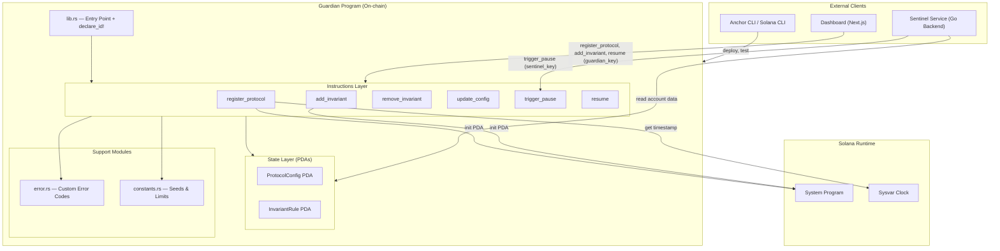
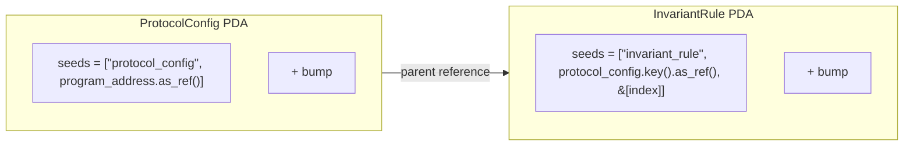
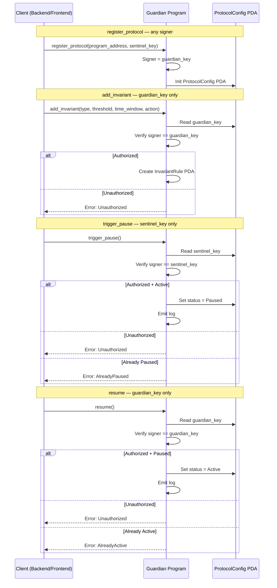

# Design Document — Killswitch Guardian Program (Anchor Smart Contract)

## Overview

Dokumen ini mendeskripsikan desain teknis untuk **Guardian Program**, smart contract on-chain dari Killswitch yang dibangun menggunakan Anchor framework (Rust) dan di-deploy ke Solana blockchain. Guardian Program bertanggung jawab untuk:

- Menyimpan konfigurasi protokol sebagai PDA (Program Derived Address) on-chain
- Menyimpan invariant rules sebagai PDA untuk evaluasi keamanan
- Menyediakan mekanisme circuit breaker on-chain (pause/resume)
- Mengotorisasi sentinel service untuk memicu emergency pause
- Mengotorisasi guardian wallet untuk manajemen konfigurasi dan resume

### Keputusan Desain Utama

| Keputusan | Pilihan | Alasan |
|-----------|---------|--------|
| Framework | Anchor (Rust) | Standard Solana program framework, macro-based account validation, auto-serialization |
| State Storage | PDA (Program Derived Address) | Deterministik, dapat ditemukan kembali dari seeds, dimiliki oleh program |
| Authorization Model | Dual-key (guardian + sentinel) | Separation of concerns: guardian untuk manajemen, sentinel untuk emergency pause |
| Serialization | Borsh (via Anchor) | Default Anchor serialization, efisien untuk on-chain data |
| Account Validation | Anchor Accounts macro | Compile-time validation, constraint checking, automatic PDA derivation |
| Error Handling | Custom error codes (#[error_code]) | Deskriptif, spesifik per kondisi, mudah di-debug dari client |
| Testing | Anchor test framework (Mocha + Chai) | Standard Anchor testing, TypeScript client, devnet-compatible |

## Architecture

### High-Level Program Architecture



### PDA Derivation Schema



### Instruction Authorization Flow



### Module Structure

```
contracts/guardian/programs/guardian/src/
├── lib.rs                          # Entry point: declare_id!, program module, instruction handlers
├── instructions/
│   ├── mod.rs                      # Re-export semua instruction modules
│   ├── register_protocol.rs        # RegisterProtocol accounts context + handler
│   ├── add_invariant.rs            # AddInvariant accounts context + handler
│   ├── remove_invariant.rs         # RemoveInvariant accounts context + handler
│   ├── update_config.rs            # UpdateConfig accounts context + handler
│   ├── trigger_pause.rs            # TriggerPause accounts context + handler
│   └── resume.rs                   # Resume accounts context + handler
├── state/
│   ├── mod.rs                      # Re-export semua state modules
│   ├── protocol_config.rs          # ProtocolConfig account struct + ProtocolStatus enum
│   └── invariant_rule.rs           # InvariantRule account struct + InvariantType, InvariantAction enums
├── error.rs                        # GuardianError enum dengan #[error_code]
└── constants.rs                    # Seeds, limits (MAX_INVARIANTS_PER_PROTOCOL)
```

## Components and Interfaces

### State Accounts

#### ProtocolConfig

Account PDA yang menyimpan konfigurasi sebuah protokol yang dilindungi.

```rust
// state/protocol_config.rs
use anchor_lang::prelude::*;

#[derive(AnchorSerialize, AnchorDeserialize, Clone, PartialEq, Eq, Debug)]
pub enum ProtocolStatus {
    Active,
    Paused,
}

#[account]
pub struct ProtocolConfig {
    /// Pubkey program Solana yang dilindungi
    pub program_address: Pubkey,
    /// Pubkey wallet guardian (otoritas penuh: register, add/remove invariant, update config, resume)
    pub guardian_key: Pubkey,
    /// Pubkey sentinel service (otoritas terbatas: trigger_pause)
    pub sentinel_key: Pubkey,
    /// Status protokol: Active atau Paused
    pub status: ProtocolStatus,
    /// Unix timestamp saat ProtocolConfig dibuat
    pub created_at: i64,
    /// Jumlah invariant rules yang terdaftar (0..MAX_INVARIANTS_PER_PROTOCOL)
    pub invariant_count: u8,
}

impl ProtocolConfig {
    /// Space calculation: 8 (discriminator) + 32 + 32 + 32 + 1 + 8 + 1 = 114 bytes
    pub const LEN: usize = 8 + 32 + 32 + 32 + 1 + 8 + 1;
}
```

#### InvariantRule

Account PDA yang menyimpan satu aturan keamanan (invariant) untuk sebuah protokol.

```rust
// state/invariant_rule.rs
use anchor_lang::prelude::*;

#[derive(AnchorSerialize, AnchorDeserialize, Clone, PartialEq, Eq, Debug)]
pub enum InvariantType {
    WithdrawalRate,
    TvlDrop,
    AdminKeyChange,
    SingleTxSize,
    ParameterChange,
}

#[derive(AnchorSerialize, AnchorDeserialize, Clone, PartialEq, Eq, Debug)]
pub enum InvariantAction {
    Pause,
    Alert,
}

#[account]
pub struct InvariantRule {
    /// Pubkey referensi ke parent ProtocolConfig PDA
    pub protocol_config: Pubkey,
    /// Tipe invariant rule
    pub invariant_type: InvariantType,
    /// Nilai threshold (misal: 5_000_000 untuk $5M withdrawal rate)
    pub threshold: u64,
    /// Time window dalam detik (misal: 60 untuk 1 menit)
    pub time_window: u32,
    /// Aksi saat invariant dilanggar
    pub action: InvariantAction,
    /// Apakah rule ini aktif
    pub enabled: bool,
    /// Index rule dalam ProtocolConfig (0-based)
    pub index: u8,
}

impl InvariantRule {
    /// Space calculation: 8 (discriminator) + 32 + 1 + 8 + 4 + 1 + 1 + 1 = 56 bytes
    pub const LEN: usize = 8 + 32 + 1 + 8 + 4 + 1 + 1 + 1;
}
```

### Error Codes

```rust
// error.rs
use anchor_lang::prelude::*;

#[error_code]
pub enum GuardianError {
    #[msg("Caller is not authorized for this action")]
    Unauthorized,
    #[msg("Protocol is already paused")]
    AlreadyPaused,
    #[msg("Protocol is already active")]
    AlreadyActive,
    #[msg("Invalid invariant type or parameters")]
    InvalidInvariant,
    #[msg("Protocol has reached maximum invariant count")]
    MaxInvariantsReached,
    #[msg("Threshold must be positive")]
    InvalidThreshold,
    #[msg("Time window must be positive")]
    InvalidTimeWindow,
}
```

### Constants

```rust
// constants.rs

/// Maksimum jumlah invariant rules per protokol
pub const MAX_INVARIANTS_PER_PROTOCOL: u8 = 10;

/// Seed untuk derivasi PDA ProtocolConfig
pub const PROTOCOL_CONFIG_SEED: &[u8] = b"protocol_config";

/// Seed untuk derivasi PDA InvariantRule
pub const INVARIANT_RULE_SEED: &[u8] = b"invariant_rule";
```

### Instruction Definitions

#### 1. register_protocol

Mendaftarkan protokol baru dan membuat ProtocolConfig PDA.

```rust
// instructions/register_protocol.rs
use anchor_lang::prelude::*;
use crate::state::protocol_config::*;
use crate::constants::*;

#[derive(Accounts)]
#[instruction(program_address: Pubkey)]
pub struct RegisterProtocol<'info> {
    #[account(
        init,
        payer = guardian,
        space = ProtocolConfig::LEN,
        seeds = [PROTOCOL_CONFIG_SEED, program_address.as_ref()],
        bump
    )]
    pub protocol_config: Account<'info, ProtocolConfig>,

    #[account(mut)]
    pub guardian: Signer<'info>,

    pub system_program: Program<'info, System>,
}

/// Handler: Inisialisasi ProtocolConfig PDA dengan field yang diberikan
/// - program_address: Pubkey program yang dilindungi
/// - sentinel_key: Pubkey sentinel service yang diotorisasi untuk trigger_pause
pub fn handler(
    ctx: Context<RegisterProtocol>,
    program_address: Pubkey,
    sentinel_key: Pubkey,
) -> Result<()> {
    let config = &mut ctx.accounts.protocol_config;
    config.program_address = program_address;
    config.guardian_key = ctx.accounts.guardian.key();
    config.sentinel_key = sentinel_key;
    config.status = ProtocolStatus::Active;
    config.created_at = Clock::get()?.unix_timestamp;
    config.invariant_count = 0;
    Ok(())
}
```

#### 2. add_invariant

Menambahkan invariant rule baru ke protokol.

```rust
// instructions/add_invariant.rs
use anchor_lang::prelude::*;
use crate::state::{protocol_config::*, invariant_rule::*};
use crate::constants::*;
use crate::error::GuardianError;

#[derive(Accounts)]
pub struct AddInvariant<'info> {
    #[account(
        mut,
        seeds = [PROTOCOL_CONFIG_SEED, protocol_config.program_address.as_ref()],
        bump,
        constraint = protocol_config.guardian_key == guardian.key() @ GuardianError::Unauthorized,
        constraint = protocol_config.invariant_count < MAX_INVARIANTS_PER_PROTOCOL @ GuardianError::MaxInvariantsReached,
    )]
    pub protocol_config: Account<'info, ProtocolConfig>,

    #[account(
        init,
        payer = guardian,
        space = InvariantRule::LEN,
        seeds = [
            INVARIANT_RULE_SEED,
            protocol_config.key().as_ref(),
            &[protocol_config.invariant_count]
        ],
        bump
    )]
    pub invariant_rule: Account<'info, InvariantRule>,

    #[account(mut)]
    pub guardian: Signer<'info>,

    pub system_program: Program<'info, System>,
}

/// Handler: Buat InvariantRule PDA baru dan increment invariant_count
pub fn handler(
    ctx: Context<AddInvariant>,
    invariant_type: InvariantType,
    threshold: u64,
    time_window: u32,
    action: InvariantAction,
) -> Result<()> {
    require!(threshold > 0, GuardianError::InvalidThreshold);
    require!(time_window > 0, GuardianError::InvalidTimeWindow);

    let config = &mut ctx.accounts.protocol_config;
    let rule = &mut ctx.accounts.invariant_rule;

    rule.protocol_config = config.key();
    rule.invariant_type = invariant_type;
    rule.threshold = threshold;
    rule.time_window = time_window;
    rule.action = action;
    rule.enabled = true;
    rule.index = config.invariant_count;

    config.invariant_count += 1;

    Ok(())
}
```

#### 3. remove_invariant

Menghapus invariant rule dan mengembalikan rent lamports ke guardian.

```rust
// instructions/remove_invariant.rs
use anchor_lang::prelude::*;
use crate::state::{protocol_config::*, invariant_rule::*};
use crate::constants::*;
use crate::error::GuardianError;

#[derive(Accounts)]
pub struct RemoveInvariant<'info> {
    #[account(
        mut,
        seeds = [PROTOCOL_CONFIG_SEED, protocol_config.program_address.as_ref()],
        bump,
        constraint = protocol_config.guardian_key == guardian.key() @ GuardianError::Unauthorized,
    )]
    pub protocol_config: Account<'info, ProtocolConfig>,

    #[account(
        mut,
        close = guardian,
        seeds = [
            INVARIANT_RULE_SEED,
            protocol_config.key().as_ref(),
            &[invariant_rule.index]
        ],
        bump,
        constraint = invariant_rule.protocol_config == protocol_config.key(),
    )]
    pub invariant_rule: Account<'info, InvariantRule>,

    #[account(mut)]
    pub guardian: Signer<'info>,
}

/// Handler: Close InvariantRule account dan decrement invariant_count
pub fn handler(ctx: Context<RemoveInvariant>) -> Result<()> {
    let config = &mut ctx.accounts.protocol_config;
    config.invariant_count -= 1;
    Ok(())
}
```

#### 4. update_config

Memperbarui guardian_key dan/atau sentinel_key pada ProtocolConfig.

```rust
// instructions/update_config.rs
use anchor_lang::prelude::*;
use crate::state::protocol_config::*;
use crate::constants::*;
use crate::error::GuardianError;

#[derive(Accounts)]
pub struct UpdateConfig<'info> {
    #[account(
        mut,
        seeds = [PROTOCOL_CONFIG_SEED, protocol_config.program_address.as_ref()],
        bump,
        constraint = protocol_config.guardian_key == guardian.key() @ GuardianError::Unauthorized,
    )]
    pub protocol_config: Account<'info, ProtocolConfig>,

    pub guardian: Signer<'info>,
}

/// Handler: Update guardian_key dan/atau sentinel_key
/// - new_guardian_key: Option<Pubkey> — jika Some, update guardian_key
/// - new_sentinel_key: Option<Pubkey> — jika Some, update sentinel_key
pub fn handler(
    ctx: Context<UpdateConfig>,
    new_guardian_key: Option<Pubkey>,
    new_sentinel_key: Option<Pubkey>,
) -> Result<()> {
    let config = &mut ctx.accounts.protocol_config;

    if let Some(key) = new_guardian_key {
        config.guardian_key = key;
    }

    if let Some(key) = new_sentinel_key {
        config.sentinel_key = key;
    }

    Ok(())
}
```

#### 5. trigger_pause

Memicu emergency pause pada protokol (hanya sentinel_key).

```rust
// instructions/trigger_pause.rs
use anchor_lang::prelude::*;
use crate::state::protocol_config::*;
use crate::constants::*;
use crate::error::GuardianError;

#[derive(Accounts)]
pub struct TriggerPause<'info> {
    #[account(
        mut,
        seeds = [PROTOCOL_CONFIG_SEED, protocol_config.program_address.as_ref()],
        bump,
        constraint = protocol_config.sentinel_key == sentinel.key() @ GuardianError::Unauthorized,
    )]
    pub protocol_config: Account<'info, ProtocolConfig>,

    pub sentinel: Signer<'info>,
}

/// Handler: Set status ke Paused dan emit log
pub fn handler(ctx: Context<TriggerPause>) -> Result<()> {
    let config = &mut ctx.accounts.protocol_config;

    require!(config.status != ProtocolStatus::Paused, GuardianError::AlreadyPaused);

    config.status = ProtocolStatus::Paused;

    msg!(
        "Protocol {} paused by sentinel {}",
        config.program_address,
        ctx.accounts.sentinel.key()
    );

    Ok(())
}
```

#### 6. resume

Melakukan resume pada protokol yang di-pause (hanya guardian_key).

```rust
// instructions/resume.rs
use anchor_lang::prelude::*;
use crate::state::protocol_config::*;
use crate::constants::*;
use crate::error::GuardianError;

#[derive(Accounts)]
pub struct Resume<'info> {
    #[account(
        mut,
        seeds = [PROTOCOL_CONFIG_SEED, protocol_config.program_address.as_ref()],
        bump,
        constraint = protocol_config.guardian_key == guardian.key() @ GuardianError::Unauthorized,
    )]
    pub protocol_config: Account<'info, ProtocolConfig>,

    pub guardian: Signer<'info>,
}

/// Handler: Set status ke Active dan emit log
pub fn handler(ctx: Context<Resume>) -> Result<()> {
    let config = &mut ctx.accounts.protocol_config;

    require!(config.status != ProtocolStatus::Active, GuardianError::AlreadyActive);

    config.status = ProtocolStatus::Active;

    msg!(
        "Protocol {} resumed by guardian {}",
        config.program_address,
        ctx.accounts.guardian.key()
    );

    Ok(())
}
```

### Program Entry Point

```rust
// lib.rs
use anchor_lang::prelude::*;

pub mod constants;
pub mod error;
pub mod instructions;
pub mod state;

use instructions::*;
use state::invariant_rule::{InvariantAction, InvariantType};

declare_id!("GUARDIAN_PROGRAM_ID_PLACEHOLDER");

#[program]
pub mod guardian {
    use super::*;

    pub fn register_protocol(
        ctx: Context<register_protocol::RegisterProtocol>,
        program_address: Pubkey,
        sentinel_key: Pubkey,
    ) -> Result<()> {
        register_protocol::handler(ctx, program_address, sentinel_key)
    }

    pub fn add_invariant(
        ctx: Context<add_invariant::AddInvariant>,
        invariant_type: InvariantType,
        threshold: u64,
        time_window: u32,
        action: InvariantAction,
    ) -> Result<()> {
        add_invariant::handler(ctx, invariant_type, threshold, time_window, action)
    }

    pub fn remove_invariant(ctx: Context<remove_invariant::RemoveInvariant>) -> Result<()> {
        remove_invariant::handler(ctx)
    }

    pub fn update_config(
        ctx: Context<update_config::UpdateConfig>,
        new_guardian_key: Option<Pubkey>,
        new_sentinel_key: Option<Pubkey>,
    ) -> Result<()> {
        update_config::handler(ctx, new_guardian_key, new_sentinel_key)
    }

    pub fn trigger_pause(ctx: Context<trigger_pause::TriggerPause>) -> Result<()> {
        trigger_pause::handler(ctx)
    }

    pub fn resume(ctx: Context<resume::Resume>) -> Result<()> {
        resume::handler(ctx)
    }
}
```

### Configuration Files

#### Anchor.toml

```toml
[features]
seeds = false
skip-lint = false

[programs.devnet]
guardian = "GUARDIAN_PROGRAM_ID_PLACEHOLDER"

[registry]
url = "https://api.apr.dev"

[provider]
cluster = "devnet"
wallet = "~/.config/solana/id.json"

[scripts]
test = "npx ts-mocha -p ./tsconfig.json -t 1000000 tests/**/*.ts"
```

#### Cargo.toml

```toml
[package]
name = "guardian"
version = "0.1.0"
description = "Killswitch Guardian Program — On-chain circuit breaker for Solana DeFi protocols"
edition = "2021"

[lib]
crate-type = ["cdylib", "lib"]
name = "guardian"

[features]
no-entrypoint = []
no-idl = []
no-log-ix-name = []
cpi = ["no-entrypoint"]
default = []

[dependencies]
anchor-lang = "0.30.1"
```

## Data Models

### On-Chain Account Layout

Semua account menggunakan Borsh serialization via Anchor. Setiap account memiliki 8-byte discriminator di awal yang di-generate otomatis oleh Anchor.

#### ProtocolConfig Account Layout

| Offset | Size (bytes) | Field | Type | Deskripsi |
|--------|-------------|-------|------|-----------|
| 0 | 8 | discriminator | [u8; 8] | Anchor account discriminator (auto) |
| 8 | 32 | program_address | Pubkey | Program Solana yang dilindungi |
| 40 | 32 | guardian_key | Pubkey | Wallet guardian (otoritas penuh) |
| 72 | 32 | sentinel_key | Pubkey | Sentinel service (otoritas pause) |
| 104 | 1 | status | ProtocolStatus | 0 = Active, 1 = Paused |
| 105 | 8 | created_at | i64 | Unix timestamp |
| 113 | 1 | invariant_count | u8 | Jumlah invariant rules (0-10) |
| **Total** | **114** | | | |

#### InvariantRule Account Layout

| Offset | Size (bytes) | Field | Type | Deskripsi |
|--------|-------------|-------|------|-----------|
| 0 | 8 | discriminator | [u8; 8] | Anchor account discriminator (auto) |
| 8 | 32 | protocol_config | Pubkey | Referensi ke parent ProtocolConfig |
| 40 | 1 | invariant_type | InvariantType | 0-4 (enum variant) |
| 41 | 8 | threshold | u64 | Nilai threshold |
| 49 | 4 | time_window | u32 | Time window dalam detik |
| 53 | 1 | action | InvariantAction | 0 = Pause, 1 = Alert |
| 54 | 1 | enabled | bool | true/false |
| 55 | 1 | index | u8 | Index dalam ProtocolConfig |
| **Total** | **56** | | | |

### PDA Derivation Rules

| Account | Seeds | Uniqueness |
|---------|-------|------------|
| ProtocolConfig | `["protocol_config", program_address]` | Satu PDA per program address |
| InvariantRule | `["invariant_rule", protocol_config_pubkey, index]` | Satu PDA per (protocol, index) pair |

### Enum Definitions

#### ProtocolStatus

| Variant | Value | Deskripsi |
|---------|-------|-----------|
| Active | 0 | Protokol beroperasi normal |
| Paused | 1 | Protokol dihentikan sementara |

#### InvariantType

| Variant | Value | Deskripsi |
|---------|-------|-----------|
| WithdrawalRate | 0 | Max withdrawal amount per time window |
| TvlDrop | 1 | Max TVL percentage drop in time window |
| AdminKeyChange | 2 | Detect authority/admin key changes |
| SingleTxSize | 3 | Max single transaction amount |
| ParameterChange | 4 | Detect safety parameter modifications |

#### InvariantAction

| Variant | Value | Deskripsi |
|---------|-------|-----------|
| Pause | 0 | Auto-pause on-chain saat threshold dilanggar |
| Alert | 1 | Notifikasi saja (tidak pause) |


## Correctness Properties

*A property is a characteristic or behavior that should hold true across all valid executions of a system — essentially, a formal statement about what the system should do. Properties serve as the bridge between human-readable specifications and machine-verifiable correctness guarantees.*

### Property 1: Serialization Round-Trip

*For any* valid ProtocolConfig state (random program_address, guardian_key, sentinel_key, status, created_at, invariant_count) and *for any* valid InvariantRule state (random protocol_config, invariant_type, threshold, time_window, action, enabled, index), serializing the account data with Borsh then deserializing it back SHALL produce an equivalent object.

**Validates: Requirements 12.3, 12.4**

### Property 2: Unauthorized Signer Rejection

*For any* keypair that is NOT the authorized key (guardian_key for management instructions, sentinel_key for trigger_pause), attempting to execute a protected instruction (add_invariant, remove_invariant, update_config, trigger_pause, resume) SHALL fail with the Unauthorized error.

**Validates: Requirements 3.2, 6.5, 7.3, 8.4, 9.2, 10.2**

### Property 3: Register Protocol Field Correctness

*For any* valid program_address (Pubkey) and sentinel_key (Pubkey), calling register_protocol SHALL create a ProtocolConfig PDA where program_address matches the input, guardian_key matches the transaction signer, sentinel_key matches the input, status is Active, and invariant_count is 0.

**Validates: Requirements 5.1, 1.4**

### Property 4: Add Invariant Correctness and Count Tracking

*For any* sequence of N valid add_invariant calls (where 1 ≤ N ≤ MAX_INVARIANTS_PER_PROTOCOL) with random valid invariant_type, threshold (> 0), time_window (> 0), and action, the resulting ProtocolConfig SHALL have invariant_count == N, and each InvariantRule SHALL have the correct field values with index values forming a sequential sequence from 0 to N-1, and enabled set to true.

**Validates: Requirements 6.1, 6.3, 6.4, 2.5**

### Property 5: Remove Invariant Closes Account and Decrements Count

*For any* ProtocolConfig with N invariants (N ≥ 1), removing one InvariantRule SHALL close that account (account no longer exists, rent returned to guardian) AND decrement invariant_count to N-1.

**Validates: Requirements 7.1, 7.2**

### Property 6: Pause/Resume Round-Trip

*For any* registered ProtocolConfig with status Active, calling trigger_pause (with sentinel_key) then resume (with guardian_key) SHALL restore the status to Active. Conversely, for any Paused protocol, calling resume then trigger_pause SHALL restore the status to Paused.

**Validates: Requirements 9.1, 10.1**

### Property 7: Update Config Key Correctness

*For any* valid new_guardian_key and/or new_sentinel_key provided to update_config, the corresponding field(s) on the ProtocolConfig SHALL be updated to the new value(s), while fields not provided (None) SHALL remain unchanged.

**Validates: Requirements 8.1, 8.2, 8.3**

## Error Handling

### Error Code Mapping

| Error Code | Kondisi Trigger | Instruksi yang Terkait |
|------------|----------------|----------------------|
| `Unauthorized` | Signer bukan guardian_key (untuk management instructions) atau bukan sentinel_key (untuk trigger_pause) | add_invariant, remove_invariant, update_config, trigger_pause, resume |
| `AlreadyPaused` | Status protokol sudah Paused saat trigger_pause dipanggil | trigger_pause |
| `AlreadyActive` | Status protokol sudah Active saat resume dipanggil | resume |
| `InvalidInvariant` | Parameter invariant tidak valid (reserved untuk future use) | add_invariant |
| `MaxInvariantsReached` | invariant_count == MAX_INVARIANTS_PER_PROTOCOL (10) | add_invariant |
| `InvalidThreshold` | threshold == 0 | add_invariant |
| `InvalidTimeWindow` | time_window == 0 | add_invariant |

### Anchor Built-in Error Handling

Selain custom error codes, Anchor framework menyediakan error handling otomatis untuk:

| Kondisi | Anchor Error | Deskripsi |
|---------|-------------|-----------|
| PDA sudah ada (init) | `AccountAlreadyInUse` / constraint error | Saat register_protocol dipanggil untuk program_address yang sudah terdaftar |
| PDA tidak ditemukan | `AccountNotInitialized` / constraint error | Saat remove_invariant dipanggil untuk InvariantRule yang tidak ada |
| Insufficient lamports | `InsufficientFunds` | Saat payer tidak punya cukup SOL untuk rent |
| Invalid PDA seeds | `ConstraintSeeds` | Saat seeds tidak cocok dengan PDA yang diharapkan |

### Error Handling Strategy per Instruksi

1. **register_protocol**: Anchor handles PDA uniqueness via `init` constraint. Tidak perlu custom error — jika PDA sudah ada, transaksi otomatis gagal.

2. **add_invariant**: Multi-layer validation:
   - Anchor constraint: `guardian_key == signer` → Unauthorized
   - Anchor constraint: `invariant_count < MAX` → MaxInvariantsReached
   - Handler validation: `threshold > 0` → InvalidThreshold
   - Handler validation: `time_window > 0` → InvalidTimeWindow

3. **remove_invariant**: Anchor constraint validates guardian_key dan PDA existence. `close = guardian` otomatis mengembalikan rent.

4. **update_config**: Anchor constraint validates guardian_key. Handler menggunakan `Option<Pubkey>` untuk update selektif — tidak ada error tambahan selain Unauthorized.

5. **trigger_pause**: Anchor constraint validates sentinel_key. Handler checks `status != Paused` → AlreadyPaused.

6. **resume**: Anchor constraint validates guardian_key. Handler checks `status != Active` → AlreadyActive.

## Testing Strategy

### Pendekatan Dual Testing

Testing untuk Guardian Program menggunakan dua pendekatan komplementer:

1. **Unit/Integration Tests (Anchor Test Framework)**: Mocha + Chai dengan TypeScript client. Menguji setiap instruksi secara end-to-end terhadap local validator.
2. **Property-Based Tests**: Menguji universal properties menggunakan library `fast-check` (JavaScript) yang diintegrasikan ke dalam Anchor test suite. Minimum 100 iterasi per property test.

### Property-Based Testing Library

- **Library**: `fast-check` (npm package `fast-check`)
- **Alasan**: Kompatibel dengan Mocha test runner yang digunakan Anchor, mature library dengan generator untuk berbagai tipe data, mendukung shrinking untuk menemukan minimal failing example
- **Konfigurasi**: Minimum 100 iterasi per property test (`numRuns: 100`)
- **Tag format**: `Feature: killswitch-guardian, Property {number}: {property_text}`

### Test Structure

```
contracts/guardian/tests/
├── guardian.ts              # Main test file — unit/integration tests
└── guardian.property.ts     # Property-based tests (fast-check)
```

### Unit/Integration Test Cases

#### register_protocol Tests
| Test Case | Tipe | Validates |
|-----------|------|-----------|
| Berhasil register protocol dengan field yang benar | Example | Req 5.1 |
| Gagal register protocol yang sudah ada (duplicate program_address) | Edge Case | Req 5.4 |

#### add_invariant Tests
| Test Case | Tipe | Validates |
|-----------|------|-----------|
| Berhasil add invariant dengan semua tipe InvariantType | Example | Req 6.1 |
| invariant_count increment setelah add | Example | Req 6.3 |
| Gagal add invariant oleh non-guardian (Unauthorized) | Example | Req 6.5 |
| Gagal add invariant saat MAX_INVARIANTS_PER_PROTOCOL tercapai | Edge Case | Req 6.6 |
| Gagal add invariant dengan threshold = 0 | Edge Case | Req 6.7 |
| Gagal add invariant dengan time_window = 0 | Edge Case | Req 6.8 |

#### remove_invariant Tests
| Test Case | Tipe | Validates |
|-----------|------|-----------|
| Berhasil remove invariant, account closed, rent returned | Example | Req 7.1 |
| invariant_count decrement setelah remove | Example | Req 7.2 |
| Gagal remove invariant oleh non-guardian (Unauthorized) | Example | Req 7.3 |

#### update_config Tests
| Test Case | Tipe | Validates |
|-----------|------|-----------|
| Berhasil update guardian_key saja | Example | Req 8.1 |
| Berhasil update sentinel_key saja | Example | Req 8.2 |
| Berhasil update keduanya sekaligus | Example | Req 8.3 |
| Gagal update oleh non-guardian (Unauthorized) | Example | Req 8.4 |

#### trigger_pause Tests
| Test Case | Tipe | Validates |
|-----------|------|-----------|
| Berhasil pause protocol (Active → Paused) | Example | Req 9.1 |
| Gagal pause oleh non-sentinel (Unauthorized) | Example | Req 9.2 |
| Gagal pause protocol yang sudah Paused (AlreadyPaused) | Edge Case | Req 9.3 |
| Log message berisi program_address dan status | Integration | Req 9.4 |

#### resume Tests
| Test Case | Tipe | Validates |
|-----------|------|-----------|
| Berhasil resume protocol (Paused → Active) | Example | Req 10.1 |
| Gagal resume oleh non-guardian (Unauthorized) | Example | Req 10.2 |
| Gagal resume protocol yang sudah Active (AlreadyActive) | Edge Case | Req 10.3 |
| Log message berisi program_address dan status | Integration | Req 10.4 |

### Property-Based Test Cases

Setiap property test menggunakan `fast-check` dengan minimum 100 iterasi dan mereferensikan property dari design document.

| Property | Test Description | Generator Strategy | Validates |
|----------|-----------------|-------------------|-----------|
| Property 1 | Serialization round-trip untuk ProtocolConfig dan InvariantRule | Random Pubkeys, random enum variants, random u64/u32/i64/u8/bool | Req 12.3, 12.4 |
| Property 2 | Unauthorized signer ditolak di semua protected instructions | Random keypairs (bukan guardian/sentinel) | Req 3.2, 6.5, 7.3, 8.4, 9.2, 10.2 |
| Property 3 | register_protocol field correctness | Random Pubkeys untuk program_address dan sentinel_key | Req 5.1, 1.4 |
| Property 4 | add_invariant correctness + count tracking | Random N (1..10), random InvariantType, random threshold (1..u64), random time_window (1..u32), random InvariantAction | Req 6.1, 6.3, 6.4, 2.5 |
| Property 5 | remove_invariant closes account + decrements count | Random N invariants, remove random one | Req 7.1, 7.2 |
| Property 6 | Pause/resume round-trip | Random protocols, pause then resume | Req 9.1, 10.1 |
| Property 7 | update_config key correctness | Random Option<Pubkey> combinations | Req 8.1, 8.2, 8.3 |

### Deployment Testing

| Test | Deskripsi | Validates |
|------|-----------|-----------|
| `anchor build` berhasil tanpa error | Compile check | Req 11, 12.1, 12.2 |
| `anchor deploy --provider.cluster devnet` berhasil | Deploy check | Req 14.1 |
| Program ID tercatat dan dapat digunakan | Deployment output | Req 14.2 |
| Anchor.toml memiliki konfigurasi devnet yang benar | Config check | Req 14.3 |
| Cargo.toml memiliki semua dependency yang diperlukan | Dependency check | Req 14.4 |
